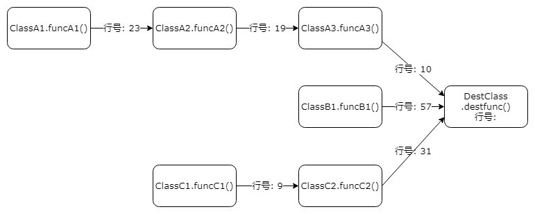
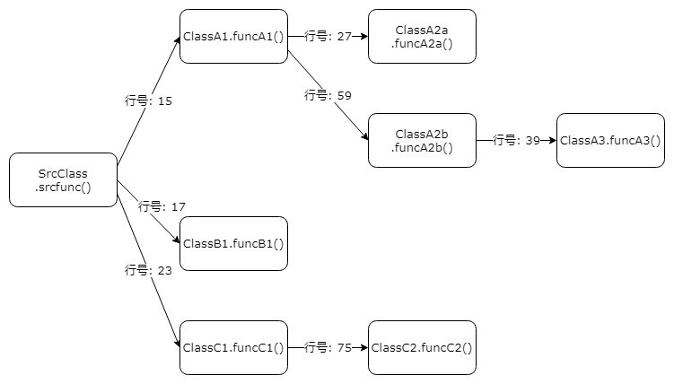

[](https://search.maven.org/artifact/com.github.adrninistrator/java-all-call-graph/)

[](https://github.com/Adrninistrator/java-all-call-graph/blob/master/LICENSE)

# 1 Introduction

In many scenarios, it is helpful to be able to generate call chains between methods in Java code.

IDEA provides the function of displaying the complete call chain up to the specified Java method, which can be used through the "Navigate -> Call Hierarchy" menu (shortcut key: Ctrl+Alt+H); Eclipse also provides the same function. However, all of the above need to be processed manually for each method. The copied text cannot show the call level, and it does not support generating a complete call chain down to the specified Java method.

The following implements a tool that can batch generate a complete call chain of the specified Java method downwards. For the concerned Java method, it can generate the method information that is called downward, and the method that the called method is called downward, until the lowest layer is called The method to call.

You can also generate a complete call chain up to the specified Java class. For methods of the Java class concerned, you can generate method information for calling the corresponding method, and information about calling the above methods, until the top layer is not called by other methods (usually Services provided to the outside world, or timed tasks, etc.).

# 2. Output example

## 2.1. A complete call chain example for calling up the specified class

The format of the output result of the complete call chain up to the specified class is similar to a tree. Each line represents a Java method, which has nothing to do with the actual code execution order. The larger the number in front, the higher the call level, and the 0 represents the method in the specified class. .

For methods that are not called by other methods, they are considered to be entry methods, and "!entry!" will be displayed at the end of the corresponding line.



When the above call relationship exists, the complete call chain of the generated call to the specified class is as follows:

```
[0]#DestClass.destfunc()
[1]# ClassA3.funcA3()
[2]# ClassA2.funcA2()
[3]# ClassA1.funcA1() !entry!
[1]# ClassB1.funcB1() !entry!
[1]# ClassC2.funcC2()
[2]# ClassC1.funcC1() !entry!
```

The following is a complete call chain of some methods that call Mybatis's SqlSessionUtils class generated by using this tool (the method parameters are too long and have been omitted):


## 2.2. Example of the complete call chain of the specified method downward

The output result of the specified method downward complete call chain is similar to a tree. Each line represents a Java method, which is consistent with the actual code execution order. The larger the number in front, the lower the call level, and the 0 represents the specified method.



When the above calling relationship exists, the complete downward calling chain of the generated specified method is as follows:

```
[0]#DestClass.destfunc()
[1]# ClassA1.funcA1()
[2]# ClassA2a.funcA2a()
[2]# ClassA2b.funcA2b()
[3]# ClassA3.funcA3()
[1]# ClassB1.funcB1()
[1]# ClassC1.funcC1()
[2]# ClassC2.funcC2()
```

The following is the complete call chain of Mybatis's SqlSessionFactoryBean:scanClasses() method generated by this tool:


In addition, when the method is specified with an annotation, it can also be displayed in the result; when a method loop call occurs, the method with a loop call will be displayed.

# 3. Applicable scenarios

## 3.1. Analyze code execution flow

Use this tool to generate the function of the specified method down call chain, which can convert the complex method calls in the code into a relatively simple method call chain form for display.

When manually viewing the generated call chain, the corresponding meaning can be identified by the class name and method name.

It is supported to ignore the method calls that are not of concern, and only show the important method calls.

It is helpful to analyze the code execution process, and is suitable for sorting out the transaction process and familiarizing the process when first contacting the code.

## 3.2. Confirm the scope of influence of the modified code

Use this tool to generate the function of the upward call chain of the specified method, and you can generate the call chain that calls all the methods of the specified class.

It can identify the entry method, reducing the workload of manually confirming the entry method layer by layer.

It can be used to quickly confirm the scope of influence of the modified code.

## 3.3. Application function split

When the application function is split, it is necessary to accurately locate the database table involved in the specified function, and use the relevant entry method of the corresponding database table.

Use this tool to generate the function of the downward call chain of the specified method, generate the downward call chain of the specified entry method, and quickly find the Mapper interface (using the Mybatis scenario) according to the package name of the class, and then you can find the relevant database table.

Use this tool to generate the function of the upward call chain of the specified method, generate the call chain of the specified Mapper interface upward, and find the entry method according to "!entry!".

Repeat the above process until no new Mapper interface (ie database table) and entry method are found, then you can confirm the database tables and related entry methods involved in the specified function.

# 4. Instructions for use

## 4.1. Dependent environment

After the tool writes the Java method call relationship into the file, it saves the data in the database and needs to access the MySQL database (in theory, other databases are supported, but the SQL statement needs to be adjusted).

The database user used needs to have DML read and write permissions, and DDL permissions (need to perform CREATE TABLE, TRUNCATE TABLE operations).

## 4.2. Introducing components

Before using the tool, you first need to introduce the dependency of the tool component in the corresponding project, and import it into the test module or use the provided type to avoid publishing to the server.

-Gradle

```
testImplementation'com.github.adrninistrator:java-all-call-graph:0.0.7'
```

-Maven

```xml
<dependency>
  <groupId>com.github.adrninistrator</groupId>
  <artifactId>java-all-call-graph</artifactId>
  <version>0.0.7</version>
  <type>provided</type>
</dependency>
```

The latest version number can be viewed [https://search.maven.org/artifact/com.github.adrninistrator/java-all-call-graph](https://search.maven.org/artifact/com.github.adrninistrator /java-all-call-graph).

The corresponding code address is [https://github.com/Adrninistrator/java-all-call-graph](https://github.com/Adrninistrator/java-all-call-graph).

It is recommended to introduce dependencies separately in the projects that need to generate method call chains, so that each project can use a separate configuration without affecting each other.

The tool only introduces the log4j-over-slf4j component. In the project that introduces the tool component, it is also necessary to introduce log4j2, logback and other log components, and ensure that the configuration is correct and can run normally locally.

## 4.3. Implementation steps

### 4.3.1. Overall steps

The overall steps of using the tool are as follows:

-a. Decompress the Java files and configuration files corresponding to several startup classes used in the subsequent steps to the corresponding directory of the test module of the current Java project. This step only needs to be performed once;
-b. Call the enhanced java-callgraph.jar (see the "Principle Description" section for details), parse the class file in the specified jar package, and write the Java method call relationship to the file; read the Java method call from the file Relationship, and then write to the MySQL database;
-c.1 When it is necessary to generate an upward complete method call chain that calls a specified class, read the method call relationship from the database, and then write the complete method call chain to the file;
-c.2 When it is necessary to generate a complete downward method call chain of the specified method, read the method call relationship from the database, and then write the complete method call chain to the file;

As shown below:


### 4.3.2. Release the startup class and configuration file

The current step only needs to be performed once in each Java project.

When executing the current step, the name of the class that needs to execute the main() method is as follows:

```
com.adrninistrator.jacg.unzip.UnzipFile
```

You need to select the classpath corresponding module as test.

After executing the above classes, the ~jacg_config and ~jacg_sql directories that save the configuration files in java-all-callgraph.jar, and the "test/jacg" directory that saves the startup class will be released to the resources and java of the test module of the current Java project. In the directory (only valid locally, avoid publishing to the server).

If the "src/test" or "src/unit.test" directory exists in the current Java project, release the configuration file and Java file in the resources and java directories of the directory respectively;

If the above directory does not exist in the current Java project, release the above files in the "~jacg-\[current timestamp\]" directory, and then you need to manually process the corresponding directory and copy the corresponding directory to the corresponding directory of the test module.

### 4.3.3. Java method call relationship storage

Before generating the Java method call relationship and writing it to the database, you need to ensure that the jar package or war package that needs to be analyzed already exists. For the jar/war package generated by the source code using the build tool, or the jar package in the Maven warehouse (need to include. jar package of class file), both can be supported.

`When the content of the class file in the jar/war package that needs to be parsed changes, you need to re-execute the current step to retrieve the Java method call relationship in the corresponding jar/war package and write it into the file and database; if you need to parse the jar If the /war package file has not changed, there is no need to re-execute the current step. `

When executing the current step, the name of the class that needs to execute the main() method is as follows:

```
test.jacg.TestRunnerWriteDb
```

You need to select the classpath corresponding module as test.

The operations performed in the current step and the related parameters used are shown in the figure below:


-b.1 The method of calling the classes in the enhanced java-callgraph.jar

The TestRunnerWriteDb class reads the parameters in the configuration file `config.properties`:

`call.graph.jar.list`: A list of jar package paths waiting to be parsed, each jar package path is separated by spaces (if the path contains spaces, you need to use "" to include the corresponding path)

Add ".txt" after the path of the first jar package as the file path of this save Java method call relationship;

Set the JVM parameter "output.file" to the path to save the Java method call relationship file this time, call the method of the class in the enhanced java-callgraph.jar, and pass the above jar package path list through the method parameter;

-b.2 Analyze the specified jar package

The methods of the classes in the enhanced java-callgraph.jar begin to parse the specified jar package;

-b.3 Write the Java method call relationship to the file

The methods of the classes in the enhanced java-callgraph.jar write the parsed Java method call relationships into the specified file;

-b.4 Read the Java method call relationship file

The TestRunnerWriteDb class reads the file that saves the Java method call relationship, and the file path is the path of the first jar package plus ".txt";

-b.5 Write the Java method call relationship to the database

The TestRunnerWriteDb class reads the configuration file `i_allowed_class_prefix.properties`, which specifies the class name prefix that needs to be processed. You can specify the package name, or package name + class name. Examples are as follows:

```
com.test
com.test.Test1
```

Read the parameters in the configuration file `config.properties`:

`app.name`: the current application name, corresponding to the suffix of the database table name, the separator in the parameter value cannot use -, it needs to use _

`thread.num`: The number of threads concurrently processed when writing to the database, which is also the number of data source connection pools

`db.driver.name`: database driver class name

`db.url`: database URL. When using MySQL, the url needs to specify rewriteBatchedStatements=true to enable batch insertion to improve efficiency

`db.username`: database user name

`db.password`: database password

`input.ignore.other.package`: Ignore the switch of other packages, the value is true/false; when the switch is on, only the class call relationship that matches the class name prefix specified in `i_allowed_class_prefix.properties` is written to the database; When the switch is off, all class call relationships are written to the database

Before writing to the database, it will determine whether the corresponding database table exists, if it does not exist, create it, and then execute the "TRUNCATE TABLE" operation to clear the data in the table;

According to the parameter value of `input.ignore.other.package` in the configuration file `config.properties` and the configuration file `i_allowed_class_prefix.properties`, write the Java method call relationships into the database one by one;

The enhanced java-callgraph.jar will not only write the Java method call relationship to the file, but also write the annotation information on each method to the file (the file name is the file name that saves the method call relationship plus "-annotation.txt "); The TestRunnerWriteDb class will also read the corresponding file and write the annotation information on each method into the database.

### 4.3.4. Generate a complete call chain up to the specified class

Before performing the current step, you need to confirm that the Java method call relationship has been successfully written to the database.

When executing the current step, the name of the class that needs to execute the main() method is as follows:

```
test.jacg.TestRunnerGenAllGraph4Callee
```

You need to select the classpath corresponding module as test.

The operations performed in the current step and the related parameters used are shown in the figure below:


-c.1.1 Read the Java method call relationship from the database

The TestRunnerGenAllGraph4Callee class reads the configuration file `o_g4callee_class_name.properties`, which specifies the class name that needs to generate a complete upward call chain; if there is a class with the same name, the class name needs to specify the full class name; if there is no class with the same name, the class name Need to specify a simple class name; examples are as follows:

```
Test1
com.test.Test1
```

Read the parameters in the configuration file `config.properties`:

`thread.num`: The number of threads that concurrently read data from the database, which is also the number of data source connection pools; if the number of records in the `o_g4callee_class_name.properties` configuration file is smaller than this value, the number of records will be used to overwrite the parameter value

The following parameter descriptions are omitted: app.name, db.driver.name, db.url, db.username, db.password

-c.1.2 Write the complete method call chain (upward) to the file

For the classes specified in the configuration file `o_g4callee_class_name.properties`, a corresponding file is generated for each class, the file name is "\[class name\].txt", and the file corresponding to a certain class will be the corresponding class Each method of generates an upward complete call chain;

The file name example above is "TestClass1.txt";

Each time it is executed, a new directory will be generated to save the output file. The format of the directory name is "~jacg_output_for_callee/\[yyyyMMdd-HHmmss.SSS\]";

Read the parameters in the configuration file `config.properties`:

`call.graph.output.detail`: the detail level of the call relationship in the output file, 1: the most detailed, including the complete class name + method name + method parameters, 2: medium, including the complete class name + method name, 3: the most detailed Simple, including simple class name (show the complete class name for the class with the same name) + method name, the example is as follows

|call.graph.output.detail parameter value|display example|
|---|---|
|1|com.test.Test1.func1(java.lang.String)|
|2|com.test.Test1.func1|
|3|Test1.func1|

`show.method.annotation`: Whether to display the annotation switch on the method in the call chain, the value is true/false; when the switch is on, the complete class name of all annotations on the current method will be displayed, in the format "\[method Information\]@說解1@說解2..."

`gen.combined.output`: Whether to generate the combined file switch of the call chain, the value is true/false; when the switch is on, after the corresponding call chain file is generated for each class, a merged file will be generated File, the file name is "~all-4callee.txt"

`gen.upwards.methods.file`: When generating an upward call chain, do you need to generate a separate file switch for each method, the value is true/false; when the switch is on, it will be each specified in o_g4callee_class_name.properties Each method of each class generates a separate file and saves it in "~jacg_output_for_callee/\[yyyyMMdd-HHmmss.SSS\]/methods"

### 4.3.5. Generate a complete downward call chain of the specified method

Before performing the current step, you need to confirm that the Java method call relationship has been successfully written to the database.

#### 4.3.5.1. Generate all call chains

When executing the current step, the name of the class that needs to execute the main() method is as follows:

```
test.jacg.TestRunnerGenAllGraph4Caller
```

You need to select the classpath corresponding module as test.

The operations performed in the current step and the related parameters used are shown in the figure below:


-c.2.1 Read the Java method call relationship from the database

The TestRunnerGenAllGraph4Caller class reads the configuration file `o_g4caller_entry_method.properties`, which specifies the class name and method name prefix that needs to generate a complete downward call chain, in the format of \[class name\]:\[method name\], or \ [Class name\]:\[Method name\]+parameters;

If there is a class with the same name, the class name needs to specify the complete class name; if there is no class with the same name, the class name needs to specify a simple class name;

Examples are as follows:

```
Test1:func1
Test1:func1(
Test1:func1(java.lang.String)
com.test.Test1:func1
com.test.Test1:func1(
com.test.Test1:func1(java.lang.String)
```

If the method prefix specified in the `o_g4caller_entry_method.properties` configuration file corresponds to multiple methods, you can specify the method prefix that needs to be ignored in the `o_g4caller_entry_method_ignore_prefix.properties` configuration file;

The format of the `o_g4caller_entry_method_ignore_prefix.properties` configuration file is method name, or method name + parameters, examples are as follows:

```
func1
func1(
func1(java.lang.String)
```

For example, specify the generation of the complete downward call chain of the Class1.test method, and the existence of the method Class1.test1, you can specify to ignore the test1 method; specify the generation of the complete downward call chain of the Class1.test method, and the test method concerned is test(java. lang.String), if there is a method test(java.lang.Integer) that you don’t care about, you can specify to ignore the test(java.lang.Integer) method;

Read the parameters in the configuration file `config.properties`:

`thread.num`: The number of threads that concurrently read data from the database, which is also the number of data source connection pools; if the number of records in the `o_g4caller_entry_method.properties` configuration file is smaller than this value, the number of records will be used to overwrite the parameter value

The following parameter descriptions are omitted: app.name, db.driver.name, db.url, db.username, db.password

-c.2.2 Write the complete method call chain (downward) to the file

For the methods specified in the configuration file `o_g4caller_entry_method.properties`, a corresponding file is generated for each method, the file name is "\[class name\]@\[method name\]@\[full method name HASH+length\] .TXT";

An example of the above file name is "TestClass1@func1@qDb0chxHzmPj1F26S7kzhw#048.txt";

Each time it is executed, a new directory will be generated to save the output file. The format of the directory name is "~jacg_output_for_caller/\[yyyyMMdd-HHmmss.SSS\]";

Read the parameters in the configuration file `config.properties`:

`gen.combined.output`: Whether to generate the combined file switch of the call chain, the value is true/false; when the switch is on, after the corresponding call chain file is generated for each class, a merged file will be generated File, the file name is "~all-4caller.txt"

The following parameter descriptions are omitted: call.graph.output.detail, show.method.annotation.

#### 4.3.5.2. Ignore specific call relationships

The complete call chain of the specified method generated above includes all the method call chains, which can be used to find the direct and indirect call methods of the specified method, for example, confirm the database table operations related to the method through the called Mybatis Mapper interface;

When generating a complete call chain down to a specified method to manually analyze the code structure, if all the method call chains are included, there will be a lot of unimportant code interference, such as reading and assigning objects such as dto and entity Operations, communication data serialization/deserialization operations (JSON and other formats), date operations, serial number generation, request field format checking, annotation/enumeration/constant/exception/date related operations, Java object default method calls, etc.;

Invoke the following classes to support ignoring the invocation relationship of methods that are not of concern:

```
test.jacg.TestRunnerGenAllGraph4CallerSupportIgnore
```

In the configuration file `o_g4caller_ignore_class_keyword.properties`, you can specify the class name keywords that need to be ignored, which can be keywords in the package name or keywords in the class name. Examples are as follows:

```
.dto.
.entity.
Enum
Constant
```

In the configuration file `o_g4caller_ignore_full_method_prefix.properties`, you can specify the complete method prefix that needs to be ignored. You can specify the package name, or package name + class name, or package name + class name + method name, or package name + class name + method name + Parameters, examples are as follows:

```
com.test
com.test.Test1
com.test.Test1:func1
com.test.Test1:func1(
com.test.Test1:func1(java.lang.String)
```

In the configuration file `o_g4caller_ignore_method_prefix.properties`, you can specify the method name prefix that needs to be ignored, such as the default method in the Java object "toString(), hashCode(), equals(java.lang.Object), \<init\>(, \<clinit\>(" etc., examples are as follows:

```
func1
func1(
func1()
func1(java.lang.String)
```

# 5. Principle description

## 5.1. Java method call relationship acquisition

When obtaining the Java method call relationship, the [https://github.com/gousiosg/java-callgraph](https://github.com/gousiosg/java-callgraph) project was used and enhanced, java -callgraph uses Apache Commons BCEL (Byte Code Engineering Library) to analyze Java method call relationships, Matthieu Vergne ([https://www.matthieu-vergne.fr/](https://www.matthieu-vergne.fr/)) Added the ability to parse dynamic calls (lambda expressions, etc.) for the project.

The original java-callgraph can obtain the Java method call relationship in most scenarios, but the call relationship in the following scenarios will be missing:

-Interface and implementation methods

If there is an interface Interface1 and its implementation class Impl1, if the interface Interface1 is introduced in a certain class Class1, it is actually an instance of the implementation class Impl1 (a common scenario when using Spring), which is called in its method Class1.func1() Interface1.fi() method;

The method call relationship generated by the original java-callgraph only includes the relationship of Class1.func1() calling Interface1.fi(), the relationship of Class1.func1() calling Impl1.fi(), and the relationship of downward calling Impl1.fi() Will be missing.

-Runnable implementation class thread call

If the f1() method uses the Runnable implementation class in the form of an internal anonymous class to perform operations in the thread, the f2() method is executed in the thread, as shown below:

```java
private void f1() {
    new Thread(new Runnable() {
        @Override
        public void run() {
            f2();
        }
    }).start();
}
```

In the method call relationship generated by the original java-callgraph, the relationship between f1() calling f2() and f2() down-calling will be missing;

The same problem exists in the case of using the Runnable implementation class in the form of a named class to perform operations in a thread. The original method calls the method executed in the thread and the call relationship that continues downward will be missing.

-Thread subclass thread call

Similar to Runnable implementation class thread call situation, omitted.

-lambda expressions (including thread calls, etc.)

If the f1() method uses the form of lambda expressions to perform operations in the thread, the f2() method is executed in the thread, as shown below:

```java
private void f1() {
    new Thread(() -> f2()).start();
}
```

In the method call relationship generated by the original java-callgraph, the relationship between f1() calling f2() and f2() down-calling will be missing;

For other cases where lambda expressions are used, the same problem exists. The original method calls the method executed in the lambda expression, and the call relationship that continues down will be missing.

-The parent class calls the implementation method of the subclass

If there is an abstract parent class Abstract1 and its non-abstract child class ChildImpl1, if the abstract parent class Abstract1 is introduced in a certain class Class1, it is actually an instance of the child class ChildImpl1 (a common scenario when using Spring), in its method Class1. Abstract1.fa() method is called in func1();

The method call relationship generated by the original java-callgraph only contains the relationship between Class1.func1() calling Abstract1.fa(), and the relationship between Class1.func1() calling ChildImpl1.fa() will be missing.

-The subclass calls the implementation method of the parent class

If there is an abstract parent class Abstract1 and its non-abstract child class ChildImpl1, if the method fi() implemented by the parent class Abstract1 is called in the ChildImpl1.fc1() method;

In the method call relationship generated by the original java-callgraph, the relationship of ChildImpl1.fc1() calling Abstract1.fi() will be missing.

In response to the above problems, the enhanced java-callgraph has been optimized to generate missing call relationships.

The enhanced java-callgraph address is [https://github.com/Adrninistrator/java-callgraph](https://github.com/Adrninistrator/java-callgraph).

For more complex situations, such as the existence of interface Interface1, its abstract implementation class Abstract1, and its subclass ChildImpl1, if the abstract implementation class Abstract1 is introduced in a certain class and its method is called, the generated method call relationship is also There will be no missing.

## 5.2. Java method complete call chain generation

After obtaining the Java method call relationship, save it in the database, which involves 3 database tables. You can view the .sql file in the ~jacg_sql directory released by java-all-callgraph.jar. The related database tables are as follows:

|Table name prefix|Comment|Function|
|---|---|---|
|class_name_|Class name information table|Save the complete and simple class names of related classes|
|method_annotation_|Method annotation table|Save method and annotation information on method|
|method_call_|Method call relationship table|Save call information between methods|

The above database table is created using the table name prefix plus the parameter value of `app.name` in the configuration file `config.properties`.

The tool will mainly query data level by level from the method call relationship table to generate a complete method call chain.

# 6. Other functions

## 6.1. Handling cyclic method calls

When generating a complete call chain of up or down Java methods, if there is a loop method call, the tool will jump out of the loop call, and add the mark "!cycle\" to the method that has a loop call in the generated method call chain. [n\]!", where n represents the corresponding level of the method called cyclically.

When generating a complete call chain of upward Java methods, an example of cyclic method calls is as follows:

```
[0]#org.springframework.transaction.TransactionDefinition:getIsolationLevel
[1]# org.springframework.transaction.support.DelegatingTransactionDefinition:getIsolationLevel
[2]# org.springframework.transaction.TransactionDefinition:getIsolationLevel !cycle[0]!
```

When generating a complete downward chain of Java method invocations, an example of cyclic method invocation is as follows:

```
[0]#org.springframework.transaction.support.TransactionTemplate:execute
[1]# org.springframework.transaction.support.CallbackPreferringPlatformTransactionManager:execute
[2]# org.springframework.transaction.jta.WebSphereUowTransactionManager:execute
[3]# org.springframework.transaction.TransactionDefinition:getTimeout
[4]# org.springframework.transaction.support.DefaultTransactionDefinition:getTimeout
[4]# org.springframework.transaction.support.DelegatingTransactionDefinition:getTimeout
[5]# org.springframework.transaction.TransactionDefinition:getTimeout !cycle[3]!
```

## 6.2. Generate a call chain between two methods

The complete call chain of up or down Java methods generated by this tool is usually relatively large. If you only focus on the call chain from a certain method to the starting method, you can generate it according to the following steps:

Execute the following java classes:

```
com.adrninistrator.jacg.other.GenSingleCallGraph
```

You need to select the classpath corresponding module as test.

In the program parameters (that is, the parameters processed by the main() method), specify the corresponding up or down Java method complete invocation chain file path, and the number of lines of the method concerned, the format is "\[complete invocation chain file path\] \[Following method line number\]".

When the file path contains spaces, you need to use "" to include; the number of lines where the focus method is located starts from 1.

For example, the content of the complete call chain file "dir/a.txt" is as follows:

```
[0]#DestClass.destfunc()
[1]# ClassA3.funcA3()
[2]# ClassA2.funcA2()
[3]# ClassA1.funcA1() !entry!
[1]# ClassB1.funcB1() !entry!
[1]# ClassC2.funcC2()
[2]# ClassC1.funcC1() !entry!
```

If you want to know the calling relationship between the "\[2\]# ClassC1.funcC1() !entry!" method on line 7 and the starting method "\[0\]#DestClass.destfunc()", you can execute the above Specify the program parameter as "dir/a.txt 7" when class, then the generated call relationship is as follows:

```
[0]#DestClass.destfunc()
[1]# ClassC2.funcC2()
[2]# ClassC1.funcC1() !entry!
```

# 7. Analysis script

In [https://github.com/Adrninistrator/java-all-call-graph](https://github.com/Adrninistrator/java-all-call-graph) "shell script", "SQL statement" directory In, the following scripts are saved, which can be used to perform some analysis operations on the code.

## 7.1. Shell script

```
Find the corresponding database table name according to Mybatis Mapper
Find the corresponding Mapper of Mybatis according to the database table name
Find the complete class name of the entry method according to the upward complete call chain
Find the simple class name of the entry method according to the upward complete call chain
Find the complete class name of the Mapper used according to the complete downward call chain
Find the Mapper method used according to the complete downward call chain
Find the simple class name of the Mapper used according to the complete downward call chain
```

## 7.2. SQL statement

SQL statements for analyzing the database tables used by the tool.

# 8. Situations that cannot be handled properly

In the following cases, the corresponding method cannot find the called relationship and may be misidentified as the entry method:

-It is not called directly through Java methods (such as configuring the code execution flow in an XML file, configuring the code execution flow through annotations, using AOP processing, etc.);
-Methods that have not been called;
-The method is used as a parameter of streaming processing, such as "xxx.stream().filter(this::func)".

# 9. Usage Suggestions

The following problems may exist:

When an interface corresponds to multiple implementation classes, if the interface is introduced in a certain class and its methods are called, the generated complete call chain may also include the call relationships related to other implementation classes that are not used by the current class;

When an abstract parent class corresponds to multiple non-abstract subclasses, if an abstract parent class is introduced into a certain class and its methods are called, the generated complete call chain may include other non-abstract subclasses that are not used by the current class. The related call relationship is also
