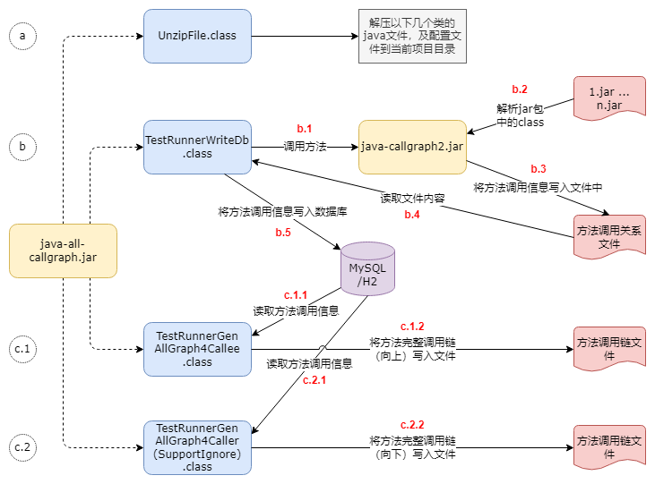
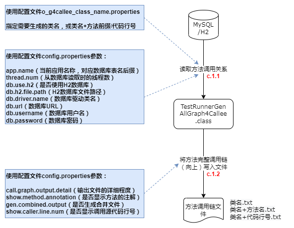
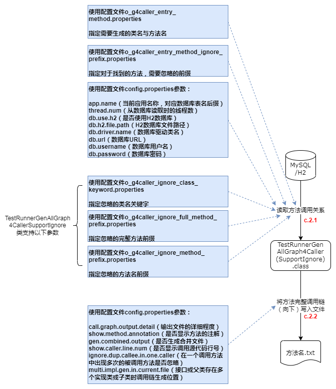

[](https://search.maven.org/artifact/com.github.adrninistrator/java-all-call-graph/)

[](https://github.com/Adrninistrator/java-all-call-graph/blob/master/LICENSE)

[README-en.md](README-en.md)

# 1. 前言

在很多场景下，如果能够生成Java代码中方法之间的调用链，是很有帮助的。

IDEA提供了显示调用指定Java方法向上的完整调用链的功能，可以通过“Navigate -> Call Hierarchy”菜单(快捷键：Ctrl+Alt+H)使用；Eclipse也提供了相同的功能。但以上都需要针对每个方法进行手工处理，拷贝出来的文本无法展示调用层级，且不支持生成指定Java方法向下的完整调用链。

以下实现了一个工具，能够批量生成指定Java方法向下的完整调用链，对于关注的Java方法，能够生成其向下调用的方法信息，及被调用方法再向下调用的方法，直到最下层被调用的方法。

也可以生成调用指定Java类向上的完整调用链，对于关注的Java类的方法，能够生成调用对应方法的方法信息，及调用上述方法的信息，直到最上层未被其他方法调用的方法（通常是对外提供的服务，或定时任务等）。

# 2. 输出结果示例

## 2.1. 调用指定类向上的完整调用链示例

调用指定类向上的完整调用链输出结果格式类似一棵树，每行代表一个Java方法，与实际的代码执行顺序无关，前面的数字越大代表调用层级越靠上，0代表指定类中的方法。

对于不被其他方法调用的方法，认为是入口方法，在对应行的最后会显示“!entry!”。


当存在上述调用关系时，生成的调用指定类向上的完整调用链如下所示：

```
[0]#DestClass.destfunc()
[1]#  ClassA3.funcA3()
[2]#    ClassA2.funcA2()
[3]#      ClassA1.funcA1()  !entry!
[1]#  ClassB1.funcB1()  !entry!
[1]#  ClassC2.funcC2()
[2]#    ClassC1.funcC1()    !entry!
```

以下为使用该工具生成的调用Mybatis的SqlSessionUtils类的部分方法向上完整调用链（方法参数太长，已省略）：


## 2.2. 指定方法向下完整调用链示例

指定方法向下完整调用链输出结果类似一棵树，每行代表一个Java方法，与实际的代码执行顺序一致，前面的数字越大代表调用层级越靠下，0代表指定方法。


当存在上述调用关系时，生成的指定方法向下完整调用链如下所示：

```
[0]#DestClass.destfunc()
[1]#  ClassA1.funcA1()
[2]#    ClassA2a.funcA2a()
[2]#    ClassA2b.funcA2b()
[3]#      ClassA3.funcA3()
[1]#  ClassB1.funcB1()
[1]#  ClassC1.funcC1()
[2]#    ClassC2.funcC2()
```

以下为使用该工具生成的Mybatis的SqlSessionFactoryBean:scanClasses()方法向下的完整调用链：


除此之外，当方法指定了注解时，也可以显示在结果中；当出现方法循环调用时，会显示出现循环调用的方法。

# 3. 适用场景

## 3.1. 分析代码执行流程

使用该工具生成指定方法向下调用链的功能，可以将代码中复杂的方法调用转换为相对简单的方法调用链形式展示。

人工查看生成的调用链时，能够通过类名及方法名识别出对应含义。

支持将不关注的方法调用忽略，仅展示重要的方法调用。

对于分析代码执行流程有一定帮助，适合梳理交易流程、首次接触代码时熟悉流程等场景。

## 3.2. 确认被修改代码的影响范围

使用该工具生成指定方法向上调用链的功能，可以生成调用指定类的所有方法的调用链。

能识别入口方法，减少人工逐层确认入口方法的工作量。

可用于快速确认被修改代码的影响范围。

## 3.3. 应用功能拆分

在进行应用功能拆分时，需要准确定位指定功能涉及的数据库表，及使用了对应数据库表的相关入口方法。

使用该工具生成指定方法向下调用链的功能，生成指定入口方法向下的调用链，能够根据类的包名快速找到Mapper接口（使用Mybatis的场景），即可找到相关的数据库表。

使用该工具生成指定方法向上调用链的功能，生成调用指定Mapper接口向上的调用链，能够根据“!entry!”找到入口方法。

重复执行以上过程，直到没有再找到新的Mapper接口（即数据库表）和入口方法，即可确认指定功能涉及的数据库表及相关入口方法。

# 4. 使用说明

## 4.1. 依赖环境

该工具将Java方法调用关系写入文件之后，会将数据保存在数据库中，需要访问MySQL数据库（理论上支持其他数据库，但需要对SQL语句进行调整）。

所使用的数据库用户需要有DML读写权限，及DDL权限（需要执行CREATE TABLE、TRUNCATE TABLE操作）。

## 4.2. 引入组件

在使用该工具前，首先需要在对应的项目引入该工具组件的依赖，将其引入到test模块或使用provided类型，可以避免发布到服务器中。

- Gradle

```
testImplementation 'com.github.adrninistrator:java-all-call-graph:0.0.4'
```

- Maven

```xml
<dependency>
  <groupId>com.github.adrninistrator</groupId>
  <artifactId>java-all-call-graph</artifactId>
  <version>0.0.4</version>
  <type>provided</type>
</dependency>
```

对应代码地址为[https://github.com/Adrninistrator/java-all-call-graph](https://github.com/Adrninistrator/java-all-call-graph)。

建议在需要生成方法调用链的项目中分别引入依赖，可以使每个项目使用单独的配置，不会相互影响。

该工具仅引入了log4j-over-slf4j组件，在引入该工具组件的项目中，还需要引入log4j2、logback等日志组件，且保证配置正确，能够在本地正常运行。

## 4.3. 执行步骤

### 4.3.1. 总体步骤

该工具的总体使用步骤如下：

- a. 将后续步骤使用的几个启动类对应的Java文件，及配置文件解压到当前Java项目的test模块的对应目录中，该步骤只需要执行一次；
- b. 调用增强后的java-callgraph.jar（详细内容见后续“原理说明”部分），解析指定jar包中的class文件，将Java方法调用关系写入文件；从该文件读取Java方法调用关系，再写入MySQL数据库；
- c.1 需要生成调用指定类的向上完整方法调用链时，从数据库读取方法调用关系，再将完整的方法调用链写入文件；
- c.2 需要生成指定方法的向下完整方法调用链时，从数据库读取方法调用关系，再将完整的方法调用链写入文件；

如下图所示：



### 4.3.2. 释放启动类及配置文件

当前步骤在每个Java项目只需要执行一次。

执行当前步骤时，需要执行main()方法的类名如下：

```
com.adrninistrator.jacg.unzip.UnzipFile
```

需要选择classpath对应模块为test。

执行以上类后，会将java-all-callgraph.jar中保存配置文件的~jacg_config、~jacg_sql目录，保存启动类的“test/jacg”目录，分别释放到当前Java项目的test模块的resources、java目录中（仅在本地生效，避免发布到服务器中）。

若当前Java项目存在“src/test”或“src/unit.test”目录，则将配置文件与Java文件分别释放在该目录的resources、java目录中；

若当前Java项目不存在以上目录，则将上述文件释放在“~jacg-\[当前时间戳\]”目录中，之后需要手工处理，将对应目录拷贝至test模块对应目录中。

### 4.3.3. Java方法调用关系入库

在生成Java方法调用关系并写入数据库之前，需要确保需要分析的jar包或war包已存在，对于通过源码使用构建工具生成的jar/war包，或者Maven仓库中的jar包（需要是包含.class文件的jar包），均可支持。

`当需要解析的jar/war包中的class文件内容发生变化时，需要重新执行当前步骤，以重新获取对应jar/war包中的Java方法调用关系，写入文件及数据库；若需要解析的jar/war包文件未发生变化，则不需要重新执行当前步骤。`

执行当前步骤时，需要执行main()方法的类名如下：

```
test.jacg.TestRunnerWriteDb
```

需要选择classpath对应模块为test。

当前步骤执行的操作及使用的相关参数如下图所示：


- b.1 调用增强后的java-callgraph.jar中的类的方法

TestRunnerWriteDb类读取配置文件`config.properties`中的参数：

`call.graph.jar.list`：等待解析的jar包路径列表，各jar包路径之间使用空格分隔（若路径中包含空格，则需要使用""包含对应的路径）

将第1个jar包路径后面加上“.txt”作为本次保存Java方法调用关系文件路径；

设置JVM参数“output.file”值为本次保存Java方法调用关系文件的路径，调用增强后的java-callgraph.jar中的类的方法，通过方法的参数传递上述jar包路径列表；

- b.2 解析指定jar包

增强后的java-callgraph.jar中的类的方法开始解析指定的jar包；

- b.3 将Java方法调用关系写入文件

增强后的java-callgraph.jar中的类的方法将解析出的Java方法调用关系写入指定的文件中；

- b.4 读取Java方法调用关系文件

TestRunnerWriteDb类读取保存Java方法调用关系的文件，文件路径即第1个jar包路径加“.txt”；

- b.5 将Java方法调用关系写入数据库

TestRunnerWriteDb类读取配置文件`i_allowed_class_prefix.properties`，该文件中指定了需要处理的类名前缀，可指定包名，或包名+类名，示例如下：

```
com.test
com.test.Test1
```

读取配置文件`config.properties`中的参数：

`app.name`：当前应用名称，对应数据库表名后缀，该参数值中的分隔符不能使用-，需要使用_

`thread.num`：写入数据库时并发处理的线程数量，也是数据源连接池数量

`db.driver.name`：数据库驱动类名

`db.url`：数据库URL，使用MySQL时，url需要指定rewriteBatchedStatements=true，开启批量插入，提高效率

`db.username`：数据库用户名

`db.password`：数据库密码

`input.ignore.other.package`：忽略其他包的开关，值为true/false；当开关为开时，仅将`i_allowed_class_prefix.properties`中指定的类名前缀相符的类调用关系写入数据库；当开关为关时，所有的类调用关系都写入数据库

向数据库写入数据库前，会判断对应数据库表是否存在，若不存在则创建，之后会执行“TRUNCATE TABLE”操作清空表中的数据；

根据配置文件`config.properties`中的`input.ignore.other.package`参数值及配置文件`i_allowed_class_prefix.properties`，将Java方法调用关系逐条写入数据库中；

增强后的java-callgraph.jar除了会将Java方法调用关系写入文件外，还会将各个方法上的注解信息写入文件（文件名为保存方法调用关系的文件名加上“-annotation.txt”）；TestRunnerWriteDb类也会读取对应文件，将各方法上的注解信息写入数据库中。

### 4.3.4. 生成调用指定类向上的完整调用链

执行当前步骤之前，需要确认Java方法调用关系已成功写入数据库中。

执行当前步骤时，需要执行main()方法的类名如下：

```
test.jacg.TestRunnerGenAllGraph4Callee
```

需要选择classpath对应模块为test。

当前步骤执行的操作及使用的相关参数如下图所示：



- c.1.1 从数据库读取Java方法调用关系

TestRunnerGenAllGraph4Callee类读取配置文件`o_g4callee_class_name.properties`，该文件中指定了需要生成向上完整调用链的类名；若存在同名类，则类名需要指定完整类名；若不存在同名类，则类名需要指定简单类名；示例如下：

```
Test1
com.test.Test1
```

读取配置文件`config.properties`中的参数：

`thread.num`：从数据库并发读取数据的线程数量，也是数据源连接池数量；若`o_g4callee_class_name.properties`配置文件中的记录数比该值小，则会使用记录数覆盖该参数值

以下参数说明略：app.name、db.driver.name、db.url、db.username、db.password

- c.1.2 将方法完整调用链（向上）写入文件

对于配置文件`o_g4callee_class_name.properties`中指定的类，对每个类生成一个对应的文件，文件名为“\[类名\].txt”，在某个类对应的文件中，会为对应类的每个方法生成向上完整调用链；

以上文件名示例为“TestClass1.txt”；

每次执行时会生成一个新的目录，用于保存输出文件，目录名格式为“~jacg_output_for_callee/\[yyyyMMdd-HHmmss.SSS\]”；

读取配置文件`config.properties`中的参数：

`call.graph.output.detail`：输出文件中调用关系的详细程度，1: 最详细，包含完整类名+方法名+方法参数，2: 中等，包含完整类名+方法名,3: 最简单,包含简单类名（对于同名类展示完整类名）+方法名，示例如下

|call.graph.output.detail参数值|显示示例|
|---|---|
|1|com.test.Test1.func1(java.lang.String)|
|2|com.test.Test1.func1|
|3|Test1.func1|

`show.method.annotation`：调用链中是否显示方法上的注解开关，值为true/false；当开关为开时，会显示当前方法上的全部注解的完整类名，格式为“\[方法信息\]@注解1@注解2...”

`gen.combined.output`：是否生成调用链的合并文件开关，值为true/false；当开关为开时，在为各个类生成了对应的调用链文件后，会生成一个将全部文件合并的文件，文件名为“~all-4callee.txt”

### 4.3.5. 生成指定方法向下完整调用链

执行当前步骤之前，需要确认Java方法调用关系已成功写入数据库中。

#### 4.3.5.1. 生成所有的调用链

执行当前步骤时，需要执行main()方法的类名如下：

```
test.jacg.TestRunnerGenAllGraph4Caller
```

需要选择classpath对应模块为test。

当前步骤执行的操作及使用的相关参数如下图所示：



- c.2.1 从数据库读取Java方法调用关系

TestRunnerGenAllGraph4Caller类读取配置文件`o_g4caller_entry_method.properties`，该文件中指定了需要生成向下完整调用链的类名与方法名前缀，格式为\[类名\]:\[方法名\]，或\[类名\]:\[方法名\]+参数；

若存在同名类，则类名需要指定完整类名；若不存在同名类，则类名需要指定简单类名；

示例如下：

```
Test1:func1
Test1:func1(
Test1:func1(java.lang.String)
com.test.Test1:func1
com.test.Test1:func1(
com.test.Test1:func1(java.lang.String)
```

若`o_g4caller_entry_method.properties`配置文件中指定的方法前缀对应多个方法，则可在`o_g4caller_entry_method_ignore_prefix.properties`配置文件中指定需要忽略的方法前缀；

`o_g4caller_entry_method_ignore_prefix.properties`配置文件的格式为方法名，或方法名+参数，示例如下：

```
func1
func1(
func1(java.lang.String)
```

例如指定生成Class1.test方法的向下完整调用链，存在方法Class1.test1，则可指定忽略test1方法；指定生成Class1.test方法的向下完整调用链，所关注的test方法为test(java.lang.String)，存在不关注的方法test(java.lang.Integer)，则可指定忽略test(java.lang.Integer)方法；

读取配置文件`config.properties`中的参数：

`thread.num`：从数据库并发读取数据的线程数量，也是数据源连接池数量；若`o_g4caller_entry_method.properties`配置文件中的记录数比该值小，则会使用记录数覆盖该参数值

以下参数说明略：app.name、db.driver.name、db.url、db.username、db.password

- c.2.2 将方法完整调用链（向下）写入文件

对于配置文件`o_g4caller_entry_method.properties`中指定的方法，对每个方法生成一个对应的文件，文件名为“\[类名\]@\[方法名\]@\[完整方法名HASH+长度\].txt”；

以上文件名示例为“TestClass1@func1@qDb0chxHzmPj1F26S7kzhw#048.txt”；

每次执行时会生成一个新的目录，用于保存输出文件，目录名格式为“~jacg_output_for_caller/\[yyyyMMdd-HHmmss.SSS\]”；

读取配置文件`config.properties`中的参数：

`gen.combined.output`：是否生成调用链的合并文件开关，值为true/false；当开关为开时，在为各个类生成了对应的调用链文件后，会生成一个将全部文件合并的文件，文件名为“~all-4caller.txt”

以下参数说明略：call.graph.output.detail、show.method.annotation。

#### 4.3.5.2. 忽略特定的调用关系

以上生成指定方法向下的完整调用链中，包含了所有的方法调用链，可用于查找指定方法直接调用及间接调用的方法，例如通过调用的Mybatis的Mapper接口确认该方法相关的数据库表操作；

当生成指定方法向下的完整调用链是为了人工分析代码结构时，若包含了所有的方法调用链，则会有很多不重要的代码产生干扰，例如对dto、entity等对象的读取及赋值操作、通信数据序列化/反序列化操作（JSON等格式）、日期操作、流水号生成、请求字段格式检查、注解/枚举/常量/异常/日期相关类操作、Java对象默认方法调用等；

调用以下类，支持将不关注的方法调用关系忽略：

```
test.jacg.TestRunnerGenAllGraph4CallerSupportIgnore
```

在配置文件`o_g4caller_ignore_class_keyword.properties`中可以指定需要忽略的类名关键字，可为包名中的关键字，或类名中的关键字，示例如下：

```
.dto.
.entity.
Enum
Constant
```

在配置文件`o_g4caller_ignore_full_method_prefix.properties`中可以指定需要忽略的完整方法前缀，可指定包名，或包名+类名，或包名+类名+方法名，或包名+类名+方法名+参数，示例如下：

```
com.test
com.test.Test1
com.test.Test1:func1
com.test.Test1:func1(
com.test.Test1:func1(java.lang.String)
```

在配置文件`o_g4caller_ignore_method_prefix.properties`中可以指定需要忽略的方法名前缀，如Java对象中的默认方法“toString()、hashCode()、equals(java.lang.Object)、\<init\>(、\<clinit\>(”等，示例如下：

```
func1
func1( 
func1()
func1(java.lang.String)
```

# 5. 原理说明

## 5.1. Java方法调用关系获取

在获取Java方法调用关系时，使用了 [https://github.com/gousiosg/java-callgraph](https://github.com/gousiosg/java-callgraph) 项目，并对其进行了增强，java-callgraph使用Apache Commons BCEL（Byte Code Engineering Library）解析Java方法调用关系，Matthieu Vergne（[https://www.matthieu-vergne.fr/](https://www.matthieu-vergne.fr/)）为该项目增加了解析动态调用的能力（lambda表达式等）。

原始java-callgraph在多数场景下能够获取到Java方法调用关系，但以下场景的调用关系会缺失：

- 接口与实现类方法

假如存在接口Interface1，及其实现类Impl1，若在某个类Class1中引入了接口Interface1，实际为实现类Impl1的实例（使用Spring时的常见场景），在其方法Class1.func1()中调用了Interface1.fi()方法；

原始java-callgraph生成的方法调用关系中，只包含Class1.func1()调用Interface1.fi()的关系，Class1.func1()调用Impl1.fi()，及Impl1.fi()向下调用的关系会缺失。

- Runnable实现类线程调用

假如f1()方法中使用内部匿名类形式的Runnable实现类在线程中执行操作，在线程中执行了f2()方法，如下所示：

```java
private void f1() {
    new Thread(new Runnable() {
        @Override
        public void run() {
            f2();
        }
    }).start();
}
```

原始java-callgraph生成的方法调用关系中，f1()调用f2()，及f2()向下调用的关系会缺失；

对于使用命名类形式的Runnable实现类在线程中执行操作的情况，存在相同的问题，原方法调用线程中执行的方法，及继续向下的调用关系会缺失。

- Thread子类线程调用

与Runnable实现类线程调用情况类似，略。

- lambda表达式（含线程调用等）

假如f1()方法中使用lambda表达式的形式在线程中执行操作，在线程中执行了f2()方法，如下所示：

```java
private void f1() {
    new Thread(() -> f2()).start();
}
```

原始java-callgraph生成的方法调用关系中，f1()调用f2()，及f2()向下调用的关系会缺失；

对于其他使用lambda表达式的情况，存在相同的问题，原方法调用lambda表达式中执行的方法，及继续向下的调用关系会缺失。

- 父类调用子类的实现方法

假如存在抽象父类Abstract1，及其非抽象子类ChildImpl1，若在某个类Class1中引入了抽象父类Abstract1，实际为子类ChildImpl1的实例（使用Spring时的常见场景），在其方法Class1.func1()中调用了Abstract1.fa()方法；

原始java-callgraph生成的方法调用关系中，只包含Class1.func1()调用Abstract1.fa()的关系，Class1.func1()调用ChildImpl1.fa()的关系会缺失。

- 子类调用父类的实现方法

假如存在抽象父类Abstract1，及其非抽象子类ChildImpl1，若在ChildImpl1.fc1()方法中调用了父类Abstract1实现的方法fi()；

原始java-callgraph生成的方法调用关系中，ChildImpl1.fc1()调用Abstract1.fi()的关系会缺失。

针对以上问题，增强后的java-callgraph都进行了优化，能够生成缺失的调用关系。

增强后的java-callgraph地址为[https://github.com/Adrninistrator/java-callgraph](https://github.com/Adrninistrator/java-callgraph)。

对于更复杂的情况，例如存在接口Interface1，及其抽象实现类Abstract1，及其子类ChildImpl1，若在某个类中引入了抽象实现类Abstract1并调用其方法的情况，生成的方法调用关系中也不会出现缺失。

## 5.2. Java方法完整调用链生成

在获取了Java方法调用关系之后，将其保存在数据库中，涉及到3个数据库表，可查看java-all-callgraph.jar释放的~jacg_sql目录中的.sql文件，相关数据库表如下所示：

|表名前缀|注释|作用|
|---|---|---|
|class_name_|类名信息表|保存相关类的完整类名及简单类名|
|method_annotation_|方法注解表|保存方法及方法上的注解信息|
|method_call_|方法调用关系表|保存各方法之间调用信息|

上述数据库表在创建时使用表名前缀加上配置文件`config.properties`中的`app.name`参数值。

该工具会主要从方法调用关系表中逐级查询数据，生成完整的方法调用链。

# 6. 其他功能

## 6.1. 处理循环方法调用

在生成向上或向下的Java方法完整调用链时，若出现了循环方法调用，该工具会从循环调用中跳出，并在生成的方法调用链中对出现循环调用的方法增加标记“!cycle\[n\]!”，其中n代表被循环调用的方法对应层级。

生成向上的Java方法完整调用链时，出现循环方法调用的示例如下：

```
[0]#org.springframework.transaction.TransactionDefinition:getIsolationLevel
[1]#  org.springframework.transaction.support.DelegatingTransactionDefinition:getIsolationLevel
[2]#    org.springframework.transaction.TransactionDefinition:getIsolationLevel	!cycle[0]!
```

生成向下的Java方法完整调用链时，出现循环方法调用的示例如下：

```
[0]#org.springframework.transaction.support.TransactionTemplate:execute
[1]#  org.springframework.transaction.support.CallbackPreferringPlatformTransactionManager:execute
[2]#    org.springframework.transaction.jta.WebSphereUowTransactionManager:execute
[3]#      org.springframework.transaction.TransactionDefinition:getTimeout
[4]#        org.springframework.transaction.support.DefaultTransactionDefinition:getTimeout
[4]#        org.springframework.transaction.support.DelegatingTransactionDefinition:getTimeout
[5]#          org.springframework.transaction.TransactionDefinition:getTimeout	!cycle[3]!
```

## 6.2. 生成两个方法之间的调用链

该工具生成的向上或向下的Java方法完整调用链通常会比较大，如果只关注某个方法到起始方法之间的调用链时，可以按照以下步骤生成：

执行以下java类：

```
com.adrninistrator.jacg.other.GenSingleCallGraph
```

需要选择classpath对应模块为test。

在程序参数（即main()方法处理的参数）中指定对应的向上或向下的Java方法完整调用链文件路径，及关注的方法所在行数，格式为“\[完整调用链文件路径\] \[关注方法所在行数\]”。

当文件路径包含空格时，需要使用""包含；关注方法所在行数从1开始。

例如完整调用链文件“dir/a.txt”内容如下：

```
[0]#DestClass.destfunc()
[1]#  ClassA3.funcA3()
[2]#    ClassA2.funcA2()
[3]#      ClassA1.funcA1()  !entry!
[1]#  ClassB1.funcB1()  !entry!
[1]#  ClassC2.funcC2()
[2]#    ClassC1.funcC1()    !entry!
```

假如希望知道第7行“\[2\]#    ClassC1.funcC1()    !entry!”方法与起始方法“\[0\]#DestClass.destfunc()”之间的调用关系，可在执行以上类时指定程序参数为“dir/a.txt 7”，则生成调用关系如下：

```
[0]#DestClass.destfunc()
[1]#  ClassC2.funcC2()
[2]#    ClassC1.funcC1()    !entry!
```

# 7. 分析脚本

在[https://github.com/Adrninistrator/java-all-call-graph](https://github.com/Adrninistrator/java-all-call-graph)的“shell脚本”、“SQL语句”目录中，保存了以下脚本，可以用于对代码进行一些分析操作。

## 7.1. shell脚本

```
根据Mybatis的Mapper查找对应数据库表名
根据数据库表名查找Mybatis的对应Mapper
根据向上完整调用链查找入口方法完整类名
根据向上完整调用链查找入口方法简单类名
根据向下完整调用链查找被使用的Mapper完整类名
根据向下完整调用链查找被使用的Mapper方法
根据向下完整调用链查找被使用的Mapper简单类名
```

## 7.2. SQL语句

针对该工具使用的数据库表进行分析的SQL语句。

# 8. 无法正确处理的情况

以下情况，对应的方法找不到被调用关系，可能会被误识别为入口方法：

- 不是直接通过Java方法进行调用的情况（例如在XML文件中配置代码执行流程、通过注解配置代码执行流程、使用AOP处理等）；
- 未被调用的方法；
- 方法作为流式处理的参数，如“xxx.stream().filter(this::func)”。

# 9. 使用建议

可能存在以下问题：

当一个接口对应多个实现类时，若在某个类中引入了接口，并调用其方法，生成的完整调用链中，可能将当前类未使用的其他实现类相关的调用关系也包含进来；

当一个抽象父类对应多个非抽象子类时，若在某个类中引入了抽象父类，并调用其方法，生成的完整调用链中，可能将当前类未使用的其他非抽象子类相关的调用关系也包含进来。

对于以上问题，可以临时修改代码但不提交，将引入的接口使用实现类替代，或抽象父类使用非抽象子类替代，生成jar包/war包后生成调用关系，再重新生成完整调用链。

当代码中使用工厂模式返回某个接口/抽象父类的实现类/非抽象子类时，若完整调用链中出现了不相关类的调用关系时，可将接口/抽象父类拷贝出一个同名类，将不相关的实现类/非抽象子类改为实现/继承拷贝出的类。
