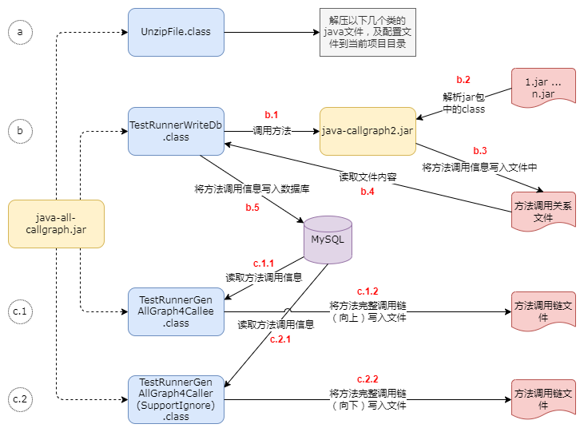
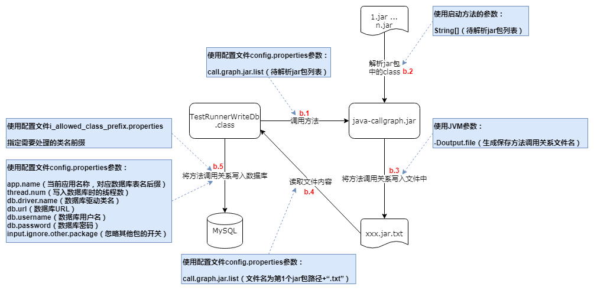
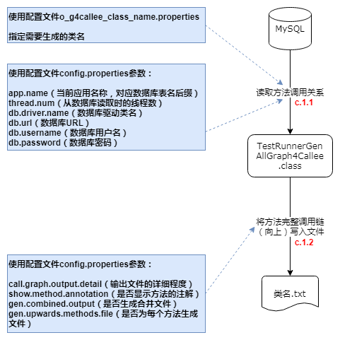
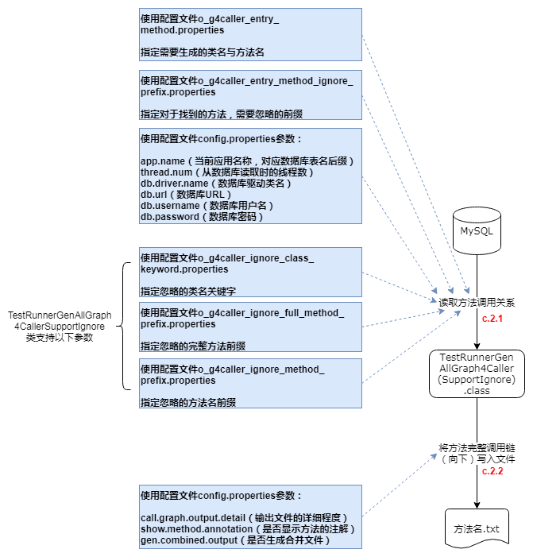

# 1. 依赖环境

本工具将Java方法调用关系写入文件之后，会将数据保存在数据库中，需要访问MySQL或H2数据库（理论上支持其他数据库，但可能需要对SQL语句进行调整）。

`建议使用本地文件形式的H2数据库`，可不依赖外部的其他数据库，使用更简单；且经过简单测试，H2比MySQL数据库的读写速度更快

所使用的数据库用户需要有DML读写权限，及DDL权限（需要执行CREATE TABLE、TRUNCATE TABLE操作）。

需要使用JDK8及以上版本

若需要通过源码启动，需要安装Gradle

# 2. 通过源码启动

通过源码启动时，可以使用测试代码进行功能验证

以下使用Java代码中指定的参数配置，与通过配置文件配置的效果一样

相关的参数定义可参考以下类

```
com.adrninistrator.jacg.common.enums.ConfigKeyEnum
com.adrninistrator.jacg.common.enums.ConfigDbKeyEnum
com.adrninistrator.jacg.common.enums.OtherConfigFileUseListEnum
com.adrninistrator.jacg.common.enums.OtherConfigFileUseSetEnum
```

- 编译测试代码

在项目根目录执行以下命令

```
gradlew test_jar
```

- 解析测试代码并将结果写入数据库

执行以下类

```
test.run_by_code.TestRBC0RunnerWriteDb
```

- 生成向上的方法完整调用链

执行以下类

```
test.run_by_code.TestRBCRunnerGenAllGraph4Callee
```

- 生成向下的方法完整调用链

执行以下类

```
test.run_by_code.TestRBCRunnerGenAllGraph4Caller
```

# 3. 引入组件

在使用本工具前，首先需要在对应的项目引入本工具组件的依赖，将其引入到test模块或使用provided类型，可以避免发布到服务器中。

- Gradle

```
testImplementation 'com.github.adrninistrator:java-all-call-graph:1.0.15'
```

- Maven

```xml
<dependency>
  <groupId>com.github.adrninistrator</groupId>
  <artifactId>java-all-call-graph</artifactId>
  <version>1.0.15</version>
</dependency>
```

`本工具仅引入了slf4j-api组件，在引入本工具组件的项目中，还需要引入log4j2、logback等日志组件，且保证配置正确，能够在本地正常运行。`

`由于Maven间接依赖的组件版本不会自动使用最大的版本号，因此可能需要在项目中手工指定java-all-call-graph依赖组件的版本号，避免因为依赖组件版本不一致导致问题，可通过java-all-call-graph与java-callgraph2的pom文件的dependencies元素查看依赖组件版本`

```
https://repo1.maven.org/maven2/com/github/adrninistrator/java-all-call-graph/1.0.15/java-all-call-graph-1.0.15.pom
https://repo1.maven.org/maven2/com/github/adrninistrator/java-callgraph2/1.0.16/java-callgraph2-1.0.16.pom
```

以上版本号可能需要替换为最新版本

java-all-call-graph最新版本号可查看[https://search.maven.org/artifact/com.github.adrninistrator/java-all-call-graph](https://search.maven.org/artifact/com.github.adrninistrator/java-all-call-graph)。

java-all-call-graph对应代码地址为[https://github.com/Adrninistrator/java-all-call-graph](https://github.com/Adrninistrator/java-all-call-graph)。

# 4. 执行步骤

以下所述执行步骤，需要在IDE中执行。假如需要使用命令行方式执行，可参考以下`使用命令行方式执行`部分内容。

## 4.1. 总体步骤

本工具的总体使用步骤如下：

- a. 将后续步骤使用的几个启动类对应的Java文件，及配置文件解压到当前Java项目的test模块的对应目录中，该步骤只需要执行一次（当组件更新时需要再次执行，以释放新的文件）；
- b. 调用增强后的java-callgraph2.jar（详细内容见后续“原理说明”部分），解析指定jar包中的class文件，将Java方法调用关系写入文件；从该文件读取Java方法调用关系，再写入数据库；
- c.1 需要生成调用指定类的向上方法完整调用链时，从数据库读取方法调用关系，再将完整的方法调用链写入文件；
- c.2 需要生成指定方法的向下方法完整调用链时，从数据库读取方法调用关系，再将完整的方法调用链写入文件；

如下图所示：



## 4.2. 释放启动类及配置文件

当前步骤在每个Java项目只需要执行一次。

`当组件升级后，若对配置文件有新增或修改，则需要再执行当前步骤，否则可能会因为缺少配置文件导致执行失败。`

从`0.7.7`版本开始，java-all-call-graph会尝试读取jar包中的配置文件，相关的配置文件可以不释放到项目中，可以通过Java代码对配置参数进行设置（进行二次开发时可能需要使用）。

执行当前步骤时，需要执行main()方法的类名如下：

```
com.adrninistrator.jacg.unzip.UnzipFile
```

需要选择classpath对应模块为test。

执行以上类后，会将java-all-callgraph.jar中保存配置文件的_jacg_config、_jacg_extensions、_jacg_find_keyword、_jacg_sql目录，保存启动类（下文涉及的Test...类）的“test/jacg”目录，分别释放到当前Java项目的test模块的resources、java目录中（仅在本地生效，避免发布到服务器中）。

若当前Java项目存在“src/test”或“src/unit.test”目录，则将配置文件与Java文件分别释放在该目录的resources、java目录中；

若当前Java项目不存在以上目录，则将上述文件释放在“_jacg-[当前时间戳]”目录中，之后需要手工将对应目录拷贝至test模块对应目录中。

当目标文件不存在时，则会进行释放；若目标文件已存在，则不会覆盖。

## 4.3. 生成Java方法调用关系并写入数据库

已支持使用本地文件形式的H2数据库，可不依赖外部的其他数据库，可在无法连接其他数据库（如MySQL）的环境中运行

H2数据库使用说明可参考[https://blog.csdn.net/a82514921/article/details/108029222](https://blog.csdn.net/a82514921/article/details/108029222)

本工具生成的H2数据库中，schema为“jacg”

在生成Java方法调用关系并写入数据库之前，需要确保需要分析的jar包或war包已存在，对于使用源码通过构建工具生成的jar/war包，或者Maven仓库中的jar包，均可支持（需要是包含.class文件的jar包）。

`当需要解析的jar/war包中的class文件内容发生变化时，需要重新执行当前步骤，以重新获取对应jar/war包中的Java方法调用关系，写入文件及数据库；若需要解析的jar/war包文件未发生变化，则不需要重新执行当前步骤。`

在后续生成Java方法完整调用链时，若发现指定的jar包未入库，或内容发生了改变，则工具会提示需要先执行当前步骤生成方法调用关系并入库。

执行当前步骤时，需要执行main()方法的类名如下：

```
test.jacg.TestRunnerWriteDb
```

需要选择classpath对应模块为test。

当前步骤执行的操作及使用的相关参数如下图所示：



### 4.3.1. b.1 调用增强后的java-callgraph2.jar中的类的方法

以上类会读取配置文件`_jacg_config/config.properties`中的参数，需要按照说明进行配置：

- call.graph.jar.list

等待解析的jar/war包，或保存class、jar文件的目录路径列表

各jar包路径之间使用空格分隔（若路径中包含空格，则需要使用""包含对应的路径）

支持指定一个或多个jar/war包，或一个或多个目录，或jar/war包与目录混合进行处理

以上参数的处理依赖java-callgraph2中实现，可参考[https://github.com/Adrninistrator/java-callgraph2](https://github.com/Adrninistrator/java-callgraph2)

设置JVM参数“merge.class.in.jar.package”值为`_jacg_config/i_allowed_class_prefix.properties`配置文件中指定的信息，并以“#”作为多行数据的分隔符；

调用增强后的java-callgraph2.jar中的JCallGraph类的run方法，通过方法的参数传递上述jar包路径列表；

### 4.3.2. b.2 解析指定jar包

增强后的java-callgraph2.jar中的类的方法开始解析指定的jar包；

### 4.3.3. b.3 将Java方法调用关系写入文件

增强后的java-callgraph2.jar中的类的方法将解析出的Java方法调用关系写入指定的文件中；

### 4.3.4. b.4 读取Java方法调用关系文件

TestRunnerWriteDb类读取保存Java方法调用关系的文件，文件路径即第1个jar包路径加“.txt”；

### 4.3.5. b.5 将Java方法调用关系写入数据库

TestRunnerWriteDb类读取配置文件`_jacg_config/i_allowed_class_prefix.properties`，该文件中指定了需要处理的类名前缀，可指定包名，或包名+类名，示例如下：

```
com.test
com.test.Test1
```

以上类会读取配置文件`_jacg_config/config.properties`中的以下参数，需要按照说明进行配置：

- app.name

当前应用名称，对应数据库表名后缀

该参数值中的分隔符不能使用“-”，需要使用“_”

- thread.num

写入数据库时并发处理的线程数量，也是数据源连接池数量

- db.use.h2

是否使用H2数据库，值为true/false

当开关为开时，还需要配置db.h2.file.path参数

当开关为关时，还需要配置db.driver.name、db.url、db.username、db.password参数

- db.h2.file.path

H2数据库文件路径（仅当使用H2数据库时需要指定）

示例：./build/jacg_h2db，不需要指定“.mv.db”

- db.driver.name

数据库驱动类名（仅当使用非H2数据库时需要指定）

- db.url

数据库JDBC URL（仅当使用非H2数据库时需要指定）

使用MySQL时，url需要指定rewriteBatchedStatements=true，开启批量插入，提高效率

- db.username

数据库用户名（仅当使用非H2数据库时需要指定）

- db.password

数据库密码（仅当使用非H2数据库时需要指定）

- input.ignore.other.package

忽略其他包的开关，值为true/false

当开关为开时，仅将`_jacg_config/i_allowed_class_prefix.properties`中指定的类名前缀相符的类调用关系写入数据库

当开关为关时，所有的类调用关系都写入数据库

以上类向数据库写入数据库前，会判断对应数据库表是否存在，若不存在则创建，之后会执行“TRUNCATE TABLE”操作清空表中的数据；

根据配置文件`_jacg_config/config.properties`中的`input.ignore.other.package`参数值及配置文件`_jacg_config/i_allowed_class_prefix.properties`，将Java方法调用关系逐条写入数据库中；

增强后的java-callgraph2.jar除了会将Java方法调用关系写入文件外，还会将各个方法上的注解信息写入文件（文件名为保存方法调用关系的文件名加上“-annotation.txt”）；TestRunnerWriteDb类也会读取对应文件，将各方法上的注解信息写入数据库中。

假如选择使用H2数据库，则当前步骤执行完毕后，会在日志中打印用于连接H2数据库的JDBC URL，日志内容如下所示：

```
可用于连接H2数据库的JDBC URL:
jdbc:h2:file:D:\test\java-all-call-graph\build\jacg_h2db
```

## 4.4. 生成调用指定类方法向上的完整调用链

执行当前步骤之前，需要确认Java方法调用关系已成功写入数据库中。

执行当前步骤时，需要执行main()方法的类名如下：

```
test.jacg.TestRunnerGenAllGraph4Callee
```

需要选择classpath对应模块为test。

当前步骤执行的操作及使用的相关参数如下图所示：



### 4.4.1. c.1.1 从数据库读取Java方法调用关系

TestRunnerGenAllGraph4Callee类读取配置文件`_jacg_config/o_g4callee_class_name.properties`，该文件中指定了需要生成向上完整调用链的类名，或类名+方法名前缀/代码行号；

格式如下：

```
[类名]
[类名]:[方法名]
[类名]:[方法名+参数]
[类名]:[代码行号]
```

假如只指定了类名，没有指定方法名或代码行号，则处理指定类的全部方法；假如指定了方法名或代码行号，则处理指定类的对应方法

[类名]可指定简单类名或完整类名；若存在同名类，则需要指定完整类名

[代码行号]可指定某个方法对应的任意代码行号，如C:f1()方法代码起止行号范围为[100,203]，则可指定以上范围的任意数字代表需要处理C:f1()方法

假如某个方法是接口中未实现的方法或抽象方法，则不支持指定代码行号的方式，需要指定方法前缀

示例如下：

```
Test1
com.test.Test1
Test1:test
Test1:test(
Test1:test(java.lang.String)
Test1:234
```

以上类会读取配置文件`_jacg_config/config.properties`中的参数，需要按照说明进行配置：

- thread.num

从数据库并发读取数据的线程数量，也是数据源连接池数量

若`_jacg_config/o_g4callee_class_name.properties`配置文件中的记录数比该值小，则会使用记录数覆盖该参数值

以下参数说明略：app.name、db.use.h2、db.h2.file.path、db.driver.name、db.url、db.username、db.password

### 4.4.2. c.1.2 将方法完整调用链（向上）写入文件

对于配置文件`_jacg_config/o_g4callee_class_name.properties`中指定的类，对每个类生成一个对应的文件，文件名为“[类名].txt”，在某个类对应的文件中，会为对应类的每个方法生成向上完整调用链；

以上文件名示例为“TestClass1.txt”

每次执行时会生成一个新的目录，用于保存输出文件，目录名格式为“_jacg_o_ee/[yyyyMMdd-HHmmss.SSS]

生成向上的调用链时，会为“\_jacg_config/o_g4callee_class_name.properties”中指定的每个类的每个方法单独生成一个文件，保存在“\_jacg_o_ee/[yyyyMMdd-HHmmss.SSS]/methods”目录中，文件名格式为“[类名]@[方法名]@[完整方法名HASH+长度].txt”

每次执行生成的目录默认保存在当前目录中，若需要保存到其他目录中，可参考[JVM参数及Java代码开关](jvm_options_java_switch.md)，“指定生成结果文件根目录”部分；

以上类会读取配置文件`_jacg_config/config.properties`中的参数，需要按照说明进行配置：

- call.graph.output.detail

输出文件中调用关系的详细程度

1: 最详细，包含完整类名+方法名+方法参数

2: 中等，包含完整类名+方法名

3: 最简单,包含简单类名（对于同名类展示完整类名）+方法名

示例如下：

|call.graph.output.detail参数值|显示示例|
|---|---|
|1|com.test.Test1.func1(java.lang.String)|
|2|com.test.Test1.func1|
|3|Test1.func1|

- show.method.annotation

调用链中是否显示方法上的注解开关，值为true/false

仅当开关为开时，会显示当前方法上的全部注解的完整类名，格式为“[方法信息]@注解1@注解2...”

- gen.combined.output

是否生成调用链的合并文件开关，值为true/false

仅当开关为开时，在为各个类生成了对应的调用链文件后，会生成一个将全部文件合并的文件，文件名为“_all-4callee.txt”

- show.caller.line.num

生成调用链时，是否需要显示调用者源代码行号开关，值为true/false

仅当开关为开时，会在向上的调用链每行后部显示当前调用者类名，及调用者方法对应的源代码行号，如“(TestClass:39)”

### 4.4.3. 生成配置文件中的任务信息与结果文件的映射关系

每次生成方法调用链后，会在本次生成的目录中创建_mapping.txt文件，在该文件中记录了配置文件中的任务信息与结果文件的映射关系

该文件内容包含两列，以“\t”进行分隔，第1列为配置文件中指定的任务信息，第2列为生成结果文件路径，内容如下所示：

```
 配置文件中指定的任务信息	生成结果文件路径
DbOperator:batchInsert(	_jacg_o_ee\20220505-211209.427\methods\DbOperator@batchInsert@PVuwu2XS1Fvxj_FQA1Ekog#056.txt
DbOperator:getInstance(	_jacg_o_ee\20220505-211209.427\methods\DbOperator@getInstance@Fg85cQ0J0brkEXpMPCoHUA#037.txt
DbOperator:268	_jacg_o_ee\20220505-211209.427\methods\DbOperator@batchInsert@PVuwu2XS1Fvxj_FQA1Ekog#056.txt
DbOperator:close(java.sql.Connection,java.sql.PreparedStatement)	_jacg_o_ee\20220505-211209.427\methods\DbOperator@close@9e5dsbPVD8648nV8on9Efw#05f.txt

RunnerGenAllGraph4Callee:101 101-101	_jacg_o_er\20220505-211230.131\RunnerGenAllGraph4Callee@doOperate@HommTjLUWABHR5l7RkDZkQ#043@101-101.txt
RunnerGenAllGraph4Callee:doOperate	_jacg_o_er\20220505-211230.131\RunnerGenAllGraph4Callee@doOperate@HommTjLUWABHR5l7RkDZkQ#043.txt
```

以上文件仅包含成功生成了调用链的任务及结果文件信息

假如在生成向上方法调用链时，在配置文件中指定了生成某个类的全部方法的调用链，也不会出现在以上文件中

## 4.5. 生成指定方法向下完整调用链

执行当前步骤之前，需要确认Java方法调用关系已成功写入数据库中。

### 4.5.1. 生成所有的调用链

执行当前步骤时，需要执行main()方法的类名如下：

```
test.jacg.TestRunnerGenAllGraph4Caller
```

需要选择classpath对应模块为test。

当前步骤执行的操作及使用的相关参数如下图所示：



### 4.5.2. c.2.1 从数据库读取Java方法调用关系

TestRunnerGenAllGraph4Caller类读取配置文件`_jacg_config/o_g4caller_entry_method.properties`，该文件中指定了需要生成向下完整调用链的类名+方法名前缀/代码行号，可指定起始代码行号、结束代码行号

格式如下所示：

```
[类名]
[类名]:[方法名] [起始代码行号]-[结束代码行号]
[类名]:[方法名+参数] [起始代码行号]-[结束代码行号]
[类名]:[代码行号] [起始代码行号]-[结束代码行号]
```

`假如仅指定了[类名]，则会处理对应类的所有方法`

[类名]可指定简单类名或完整类名；若存在同名类，则需要指定完整类名

若存在同名方法，则需要指定方法参数以区分，或者在o_g4caller_entry_method_ignore_prefix.properties中指定需要忽略的方法前缀

[起始代码行号]-[结束代码行号]为可选参数，若不指定则输出指定的整个方法向下的方法完整调用链；若指定则输出方法指定行号范围内向下的方法完整调用链，即 >= 起始代码行号 且 <= 结束代码行号的范围

[代码行号]可指定某个方法对应的任意代码行号，如C:f1()方法代码起止行号范围为[100,203]，则可指定以上范围的任意数字代表需要处理C:f1()方法

示例如下：

```
Test1:func1 139-492
Test1:func1(
Test1:func1(java.lang.String)
com.test.Test1:func1 395-1358
com.test.Test1:func1(
com.test.Test1:func1(java.lang.String)
Test1:139
Test1:139 139-492
```

若`_jacg_config/o_g4caller_entry_method.properties`配置文件中指定的方法前缀对应多个方法，则可在`_jacg_config/o_g4caller_entry_method_ignore_prefix.properties`配置文件中指定需要忽略的方法前缀；

`_jacg_config/o_g4caller_entry_method_ignore_prefix.properties`配置文件的格式为方法名，或方法名+参数，示例如下：

```
func1
func1(
func1(java.lang.String)
```

例如指定生成Class1.test方法的向下完整调用链，存在方法Class1.test1，则可指定忽略test1方法；指定生成Class1.test方法的向下完整调用链，所关注的test方法为test(java.lang.String)，存在不关注的方法test(java.lang.Integer)，则可指定忽略test(java.lang.Integer)方法；

以上类会读取配置文件`_jacg_config/config.properties`中的参数，需要按照说明进行配置：

- thread.num

从数据库并发读取数据的线程数量，也是数据源连接池数量

若`_jacg_config/o_g4caller_entry_method.properties`配置文件中的记录数比该值小，则会使用记录数覆盖该参数值

以下参数说明略：app.name、db.use.h2、db.h2.file.path、db.driver.name、db.url、db.username、db.password

### 4.5.3. c.2.2 将方法完整调用链（向下）写入文件

对于配置文件`_jacg_config/o_g4caller_entry_method.properties`中指定的方法，对每个方法生成一个对应的文件，文件名为“[类名]@[方法名]@[完整方法名HASH+长度].txt”，示例为“TestClass1@func1@qDb0chxHzmPj1F26S7kzhw#048.txt”；

若某个方法生成向下的完整调用链时指定了代码行号范围，则对应文件名为“[类名]@[方法名]@[完整方法名HASH+长度]@[起始代码行号]-[结束代码行号].txt”，示例为“TestClass1@func1@qDb0chxHzmPj1F26S7kzhw#048@135-395.txt”；

每次执行时会生成一个新的目录，用于保存输出文件，目录名格式为“_jacg_o_er/[yyyyMMdd-HHmmss.SSS]”；

每次执行生成的目录默认保存在当前目录中，若需要保存到其中目录中，可通过执行Java命令时的JVM参数`output.root.path`指定，例如“java -Doutput.root.path=D:/test”；

以上类会读取配置文件`_jacg_config/config.properties`中的参数，需要按照说明进行配置：

- gen.combined.output

是否生成调用链的合并文件开关，值为true/false

仅当开关为开时，在为各个类生成了对应的调用链文件后，会生成一个将全部文件合并的文件，文件名为“_all-4caller.txt”

- show.caller.line.num

生成调用链时，是否需要显示调用者源代码行号开关，值为true/false

仅当开关为开时，会在向下的调用链每行前部显示当前调用者类名，及调用者方法对应的源代码行号，如“[TestClass:39]”

- ignore.dup.callee.in.one.caller

生成向下的调用链时，在一个调用方法中出现多次的被调用方法（包含自定义数据），是否需要忽略，值为true/false

仅当开关为开时会忽略

默认值为关

- multi.impl.gen.in.current.file

生成向下的调用链时，若接口或父类存在多个实现类或子类，对于接口或父类方法调用多个实现类或子类方法的调用关系，是否需要在当前文件中继续生成，值为true/false

当开关为开时，以上调用关系会在当前文件中继续生成

当开关为关时，以上调用关系会在单独的目录中生成，目录名格式为“[接口或父类名]@[方法名]@[完整方法名HASH+长度]”，文件名格式为“[实现类或子类名]@[方法名]@[完整方法名HASH+长度].txt”；原始方法调用链对应的文件中，会记录当前方法调用接口或父类方法的调用关系，使用特殊的标记，格式为“!ext_data!JUMP_MULTI_IMPL@[接口或父类名]@[方法名]@[完整方法名HASH+长度]”

默认值为开

例如TestMulti.test1()方法中调用了Interface1接口的f1()方法，Interface1接口存在实现类ImplClass1、ImplClass2；

当以上开关为开时，Interface1.f1()方法调用ImplClass1.f1()、ImplClass2.f1()方法的调用关系会继续在TestMulti.test1()方法对应文件中生成；

当以上开关为关时，生成文件情况如下

TestMulti.test1()方法对应文件中调用Interface1.f1()方法的信息如下：

```
[1]#  [TestMulti:22]	test.call_graph.implement.Interface1:f1	!ext_data!JUMP_MULTI_IMPL@Interface1@f1@ix-_NHnAUilDstHxNyrtxQ#029
```

生成Interface1.f1()方法对应的目录，目录名为“Interface1@f1@ix-_NHnAUilDstHxNyrtxQ#029”

在以上目录中，分别生成ImplClass1.f1()、ImplClass2.f1()方法对应的保存调用链的文件，文件名为“ImplClass1@f1@28XJlqE5etyRh1WH_e_DLQ#029.txt”、“ImplClass2@f1@FixDUSOINEA0qji9Np3baA#029.txt”

以下参数说明略：call.graph.output.detail、show.method.annotation

### 4.5.4. 忽略特定的调用关系

以上生成指定方法向下的完整调用链中，包含了所有的方法调用链，可用于查找指定方法直接调用及间接调用的方法，例如通过调用的Mybatis的Mapper接口确认该方法相关的数据库表操作；

当生成指定方法向下的完整调用链是为了人工分析代码结构时，若包含了所有的方法调用链，则会有很多不重要的代码产生干扰，例如对dto、entity等对象的读取及赋值操作、通信数据序列化/反序列化操作（JSON等格式）、日期操作、流水号生成、请求字段格式检查、注解/枚举/常量/异常/日期相关类操作、Java对象默认方法调用等；

调用以下类，支持将不关注的方法调用关系忽略：

```
test.jacg.TestRunnerGenAllGraph4CallerSupportIgnore
```

在配置文件`_jacg_config/o_g4caller_ignore_class_keyword.properties`中可以指定需要忽略的类名关键字，可为包名中的关键字，或类名中的关键字，示例如下：

```
.dto.
.entity.
Enum
Constant
```

在配置文件`_jacg_config/o_g4caller_ignore_full_method_prefix.properties`中可以指定需要忽略的完整方法前缀，可指定包名，或包名+类名，或包名+类名+方法名，或包名+类名+方法名+参数，示例如下：

```
com.test
com.test.Test1
com.test.Test1:func1
com.test.Test1:func1(
com.test.Test1:func1(java.lang.String)
```

在配置文件`_jacg_config/o_g4caller_ignore_method_prefix.properties`中可以指定需要忽略的方法名前缀，如Java对象中的默认方法“toString()、hashCode()、equals(java.lang.Object)、\<init\>(、\<clinit\>(”等，示例如下：

```
func1
func1( 
func1()
func1(java.lang.String)
```

### 4.5.5. 生成配置文件中的任务信息与结果文件的映射关系

见前文

# 5. 使用命令行方式执行

以上所述执行方式，需要在IDE中执行，假如需要使用命令行方式执行，可参考以下方法。

在项目根目录执行`gradlew gen_run_jar`命令，生成可以直接执行的jar包，并拷贝相关文件。

在生成的`output_dir`目录中，包含了当前项目生成的jar包、依赖jar包，以及资源文件、启动脚本等，如下所示：

```
_jacg_config
_jacg_extensions
_jacg_find_keyword
_jacg_sql
config
jar
lib
xxx.bat
xxx.sh
```

可根据操作系统选择对应脚本，以命令行方式执行，脚本中执行的类可为test.jacg包中的类，各脚本及作用如下所示：

|脚本名称|作用|
|---|---|
|write_db.xx|生成Java方法调用关系并写入数据库|
|gen_all_graph4_callee.xx|生成调用指定类方法向上的完整调用链|
|gen_all_graph4_caller.xx|生成指定方法向下完整调用链|
|find_keyword_call_graph4_ee.xx|生成包含关键字的所有方法到起始方法之间的调用链（向上）|
|find_keyword_call_graph4_er.xx|生成包含关键字的所有方法到起始方法之间的调用链（向下）|
