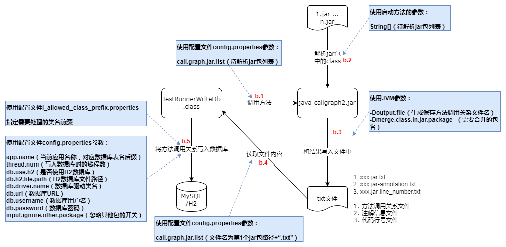

# 1. 使用说明

## 1.1. 依赖环境

本工具将Java方法调用关系写入文件之后，会将数据保存在数据库中，需要访问MySQL或H2数据库（理论上支持其他数据库，但可能需要对SQL语句进行调整）。

`建议使用本地文件形式的H2数据库`，可不依赖外部的其他数据库，使用更简单；且经过简单测试，H2比MySQL数据库的读写速度更快

所使用的数据库用户需要有DML读写权限，及DDL权限（需要执行CREATE TABLE、TRUNCATE TABLE操作）。

## 1.2. 引入组件

在使用本工具前，首先需要在对应的项目引入本工具组件的依赖，将其引入到test模块或使用provided类型，可以避免发布到服务器中。

- Gradle

```
testImplementation 'com.github.adrninistrator:java-all-call-graph:0.7.1'
```

- Maven

```xml
<dependency>
  <groupId>com.github.adrninistrator</groupId>
  <artifactId>java-all-call-graph</artifactId>
  <version>0.7.1</version>
</dependency>
```

最新版本号可查看[https://search.maven.org/artifact/com.github.adrninistrator/java-all-call-graph](https://search.maven.org/artifact/com.github.adrninistrator/java-all-call-graph)。

对应代码地址为[https://github.com/Adrninistrator/java-all-call-graph](https://github.com/Adrninistrator/java-all-call-graph)。

建议在需要生成方法调用链的项目中分别引入依赖，可以使每个项目使用单独的配置，不会相互影响。

本工具仅引入了log4j-over-slf4j组件，在引入本工具组件的项目中，还需要引入log4j2、logback等日志组件，且保证配置正确，能够在本地正常运行。

## 1.3. 执行步骤

以下所述执行步骤，需要在IDE中执行。

### 1.3.1. 总体步骤

本工具的总体使用步骤如下：

- a. 将后续步骤使用的几个启动类对应的Java文件，及配置文件解压到当前Java项目的test模块的对应目录中，该步骤只需要执行一次（当组件更新时需要再次执行，以释放新的文件）；
- b. 调用增强后的java-callgraph2.jar（详细内容见后续“原理说明”部分），解析指定jar包中的class文件，将Java方法调用关系写入文件；从该文件读取Java方法调用关系，再写入数据库；
- c.1 需要生成调用指定类的向上完整方法调用链时，从数据库读取方法调用关系，再将完整的方法调用链写入文件；
- c.2 需要生成指定方法的向下完整方法调用链时，从数据库读取方法调用关系，再将完整的方法调用链写入文件；

如下图所示：


### 1.3.2. 释放启动类及配置文件

当前步骤在每个Java项目只需要执行一次。

`当组件升级后，若对配置文件有新增或修改，则需要再执行当前步骤，否则可能会因为缺少配置文件导致执行失败。`

执行当前步骤时，需要执行main()方法的类名如下：

```
com.adrninistrator.jacg.unzip.UnzipFile
```

需要选择classpath对应模块为test。

执行以上类后，会将java-all-callgraph.jar中保存配置文件的~jacg_config、~jacg_extensions、~jacg_find_keyword、~jacg_sql目录，保存启动类（下文涉及的Test...类）的“test/jacg”目录，分别释放到当前Java项目的test模块的resources、java目录中（仅在本地生效，避免发布到服务器中）。

若当前Java项目存在“src/test”或“src/unit.test”目录，则将配置文件与Java文件分别释放在该目录的resources、java目录中；

若当前Java项目不存在以上目录，则将上述文件释放在“~jacg-\[当前时间戳\]”目录中，之后需要手工将对应目录拷贝至test模块对应目录中。

当目标文件不存在时，则会进行释放；若目标文件已存在，则不会覆盖。

### 1.3.3. 生成Java方法调用关系并写入数据库

已支持使用本地文件形式的H2数据库，可不依赖外部的其他数据库，可在无法连接其他数据库（如MySQL）的环境中运行

H2数据库使用说明可参考[https://blog.csdn.net/a82514921/article/details/108029222](https://blog.csdn.net/a82514921/article/details/108029222)

本工具生成的H2数据库中，schema为“jacg”

在生成Java方法调用关系并写入数据库之前，需要确保需要分析的jar包或war包已存在，对于使用源码通过构建工具生成的jar/war包，或者Maven仓库中的jar包，均可支持（需要是包含.class文件的jar包）。

`当需要解析的jar/war包中的class文件内容发生变化时，需要重新执行当前步骤，以重新获取对应jar/war包中的Java方法调用关系，写入文件及数据库；若需要解析的jar/war包文件未发生变化，则不需要重新执行当前步骤。`

在后续生成Java方法完整调用链时，若发现指定的jar包未入库，或内容发生了改变，则工具会提示需要先执行当前步骤生成方法调用关系并入库。

执行当前步骤时，需要执行main()方法的类名如下：

```
test.jacg.TestRunnerWriteDb
```

需要选择classpath对应模块为test。

当前步骤执行的操作及使用的相关参数如下图所示：



- b.1 调用增强后的java-callgraph2.jar中的类的方法

TestRunnerWriteDb类读取配置文件`~jacg_config/config.properties`中的参数：

`call.graph.jar.list`：等待解析的jar/war包，或保存class、jar文件的目录路径列表，各jar包路径之间使用空格分隔（若路径中包含空格，则需要使用""包含对应的路径），支持指定一个或多个jar/war包，或一个或多个目录，或jar/war包与目录混合进行处理

以上参数的处理依赖java-callgraph2中实现，可参考[https://github.com/Adrninistrator/java-callgraph2](https://github.com/Adrninistrator/java-callgraph2)

设置JVM参数“merge.class.in.jar.package”值为`~jacg_config/i_allowed_class_prefix.properties`配置文件中指定的信息，并以“#”作为多行数据的分隔符；

调用增强后的java-callgraph2.jar中的JCallGraph类的run方法，通过方法的参数传递上述jar包路径列表；

- b.2 解析指定jar包

增强后的java-callgraph2.jar中的类的方法开始解析指定的jar包；

- b.3 将Java方法调用关系写入文件

增强后的java-callgraph2.jar中的类的方法将解析出的Java方法调用关系写入指定的文件中；

- b.4 读取Java方法调用关系文件

TestRunnerWriteDb类读取保存Java方法调用关系的文件，文件路径即第1个jar包路径加“.txt”；

- b.5 将Java方法调用关系写入数据库

TestRunnerWriteDb类读取配置文件`~jacg_config/i_allowed_class_prefix.properties`，该文件中指定了需要处理的类名前缀，可指定包名，或包名+类名，示例如下：

```
com.test
com.test.Test1
```

读取配置文件`~jacg_config/config.properties`中的参数：

`app.name`：当前应用名称，对应数据库表名后缀，该参数值中的分隔符不能使用“-”，需要使用“_”

`thread.num`：写入数据库时并发处理的线程数量，也是数据源连接池数量

`db.use.h2`：是否使用H2数据库，值为true/false；当开关为开时，还需要配置db.h2.file.path参数，当开关为关时，还需要配置db.driver.name、db.url、db.username、db.password参数

`db.h2.file.path`：H2数据库文件路径（仅当使用H2数据库时需要指定），示例：./build/jacg_h2db，不需要指定“.mv.db”

`db.driver.name`：数据库驱动类名（仅当使用非H2数据库时需要指定）

`db.url`：数据库JDBC URL（仅当使用非H2数据库时需要指定），使用MySQL时，url需要指定rewriteBatchedStatements=true，开启批量插入，提高效率

`db.username`：数据库用户名（仅当使用非H2数据库时需要指定）

`db.password`：数据库密码（仅当使用非H2数据库时需要指定）

`input.ignore.other.package`：忽略其他包的开关，值为true/false；当开关为开时，仅将`~jacg_config/i_allowed_class_prefix.properties`中指定的类名前缀相符的类调用关系写入数据库；当开关为关时，所有的类调用关系都写入数据库

向数据库写入数据库前，会判断对应数据库表是否存在，若不存在则创建，之后会执行“TRUNCATE TABLE”操作清空表中的数据；

根据配置文件`~jacg_config/config.properties`中的`input.ignore.other.package`参数值及配置文件`~jacg_config/i_allowed_class_prefix.properties`，将Java方法调用关系逐条写入数据库中；

增强后的java-callgraph2.jar除了会将Java方法调用关系写入文件外，还会将各个方法上的注解信息写入文件（文件名为保存方法调用关系的文件名加上“-annotation.txt”）；TestRunnerWriteDb类也会读取对应文件，将各方法上的注解信息写入数据库中。

### 1.3.4. 生成调用指定类方法向上的完整调用链

执行当前步骤之前，需要确认Java方法调用关系已成功写入数据库中。

执行当前步骤时，需要执行main()方法的类名如下：

```
test.jacg.TestRunnerGenAllGraph4Callee
```

需要选择classpath对应模块为test。

当前步骤执行的操作及使用的相关参数如下图所示：


- c.1.1 从数据库读取Java方法调用关系

TestRunnerGenAllGraph4Callee类读取配置文件`~jacg_config/o_g4callee_class_name.properties`，该文件中指定了需要生成向上完整调用链的类名；

类名可指定简单类名或完整类名；若存在同名类，则需要指定完整类名；

示例如下：

```
Test1
com.test.Test1
```

读取配置文件`~jacg_config/config.properties`中的参数：

`thread.num`：从数据库并发读取数据的线程数量，也是数据源连接池数量；若`~jacg_config/o_g4callee_class_name.properties`配置文件中的记录数比该值小，则会使用记录数覆盖该参数值

以下参数说明略：app.name、db.use.h2、db.h2.file.path、db.driver.name、db.url、db.username、db.password

- c.1.2 将方法完整调用链（向上）写入文件

对于配置文件`~jacg_config/o_g4callee_class_name.properties`中指定的类，对每个类生成一个对应的文件，文件名为“\[类名\].txt”，在某个类对应的文件中，会为对应类的每个方法生成向上完整调用链；

以上文件名示例为“TestClass1.txt”；

每次执行时会生成一个新的目录，用于保存输出文件，目录名格式为“~jacg_o_ee/\[yyyyMMdd-HHmmss.SSS\]”；

读取配置文件`~jacg_config/config.properties`中的参数：

`call.graph.output.detail`：输出文件中调用关系的详细程度，1: 最详细，包含完整类名+方法名+方法参数，2: 中等，包含完整类名+方法名,3: 最简单,包含简单类名（对于同名类展示完整类名）+方法名，示例如下

|call.graph.output.detail参数值|显示示例|
|---|---|
|1|com.test.Test1.func1(java.lang.String)|
|2|com.test.Test1.func1|
|3|Test1.func1|

`show.method.annotation`：调用链中是否显示方法上的注解开关，值为true/false；当开关为开时，会显示当前方法上的全部注解的完整类名，格式为“\[方法信息\]@注解1@注解2...”

`gen.combined.output`：是否生成调用链的合并文件开关，值为true/false；当开关为开时，在为各个类生成了对应的调用链文件后，会生成一个将全部文件合并的文件，文件名为“~all-4callee.txt”

`show.caller.line.num`：生成调用链时，是否需要显示调用者源代码行号开关，值为true/false；当开关为开时，会在向上的调用链每行后部显示当前调用者类名，及调用者方法对应的源代码行号，如“(TestClass:39)”

`gen.upwards.methods.file`：生成向上的调用链时，是否需要为每个方法生成单独的文件开关，值为true/false；当开关为开时，会为~jacg_config/o_g4callee_class_name.properties中指定的每个类的每个方法单独生成一个文件，保存在“~jacg_o_ee/\[yyyyMMdd-HHmmss.SSS\]/methods”目录中，文件名格式为“\[类名\]@\[方法名\]@\[完整方法名HASH+长度\].txt”

### 1.3.5. 生成指定方法向下完整调用链

执行当前步骤之前，需要确认Java方法调用关系已成功写入数据库中。

#### 1.3.5.1. 生成所有的调用链

执行当前步骤时，需要执行main()方法的类名如下：

```
test.jacg.TestRunnerGenAllGraph4Caller
```

需要选择classpath对应模块为test。

当前步骤执行的操作及使用的相关参数如下图所示：


- c.2.1 从数据库读取Java方法调用关系

TestRunnerGenAllGraph4Caller类读取配置文件`~jacg_config/o_g4caller_entry_method.properties`，该文件中指定了需要生成向下完整调用链的类名与方法名前缀，格式为\[类名\]:\[方法名\] \[起始代码行号\]-\[结束代码行号\]，或\[类名\]:\[方法名+参数\] \[起始代码行号\]-\[结束代码行号\]；

\[起始代码行号\]-\[结束代码行号\]为可选参数，若不指定则输出指定的整个方法向下的方法完整调用链，若指定则输出方法指定行号范围内向下的方法完整调用链，即 >= 起始代码行号 且 <= 结束代码行号的范围；

类名可指定简单类名或完整类名；若存在同名类，则需要指定完整类名；

示例如下：

```
Test1:func1 139-492
Test1:func1(
Test1:func1(java.lang.String)
com.test.Test1:func1 395-1358
com.test.Test1:func1(
com.test.Test1:func1(java.lang.String)
```

若`~jacg_config/o_g4caller_entry_method.properties`配置文件中指定的方法前缀对应多个方法，则可在`~jacg_config/o_g4caller_entry_method_ignore_prefix.properties`配置文件中指定需要忽略的方法前缀；

`~jacg_config/o_g4caller_entry_method_ignore_prefix.properties`配置文件的格式为方法名，或方法名+参数，示例如下：

```
func1
func1(
func1(java.lang.String)
```

例如指定生成Class1.test方法的向下完整调用链，存在方法Class1.test1，则可指定忽略test1方法；指定生成Class1.test方法的向下完整调用链，所关注的test方法为test(java.lang.String)，存在不关注的方法test(java.lang.Integer)，则可指定忽略test(java.lang.Integer)方法；

读取配置文件`~jacg_config/config.properties`中的参数：

`thread.num`：从数据库并发读取数据的线程数量，也是数据源连接池数量；若`~jacg_config/o_g4caller_entry_method.properties`配置文件中的记录数比该值小，则会使用记录数覆盖该参数值

以下参数说明略：app.name、db.use.h2、db.h2.file.path、db.driver.name、db.url、db.username、db.password

- c.2.2 将方法完整调用链（向下）写入文件

对于配置文件`~jacg_config/o_g4caller_entry_method.properties`中指定的方法，对每个方法生成一个对应的文件，文件名为“\[类名\]@\[方法名\]@\[完整方法名HASH+长度\].txt”，示例为“TestClass1@func1@qDb0chxHzmPj1F26S7kzhw#048.txt”；

若某个方法生成向下的完整调用链时指定了代码行号范围，则对应文件名为“\[类名\]@\[方法名\]@\[完整方法名HASH+长度\]@\[起始代码行号\]-\[结束代码行号\].txt”，示例为“TestClass1@func1@qDb0chxHzmPj1F26S7kzhw#048@135-395.txt”；

每次执行时会生成一个新的目录，用于保存输出文件，目录名格式为“~jacg_o_er/\[yyyyMMdd-HHmmss.SSS\]”；

读取配置文件`~jacg_config/config.properties`中的参数：

`gen.combined.output`：是否生成调用链的合并文件开关，值为true/false；当开关为开时，在为各个类生成了对应的调用链文件后，会生成一个将全部文件合并的文件，文件名为“~all-4caller.txt”

`show.caller.line.num`：生成调用链时，是否需要显示调用者源代码行号开关，值为true/false；当开关为开时，会在向下的调用链每行前部显示当前调用者类名，及调用者方法对应的源代码行号，如“\[TestClass:39\]”

以下参数说明略：call.graph.output.detail、show.method.annotation。

#### 1.3.5.2. 忽略特定的调用关系

以上生成指定方法向下的完整调用链中，包含了所有的方法调用链，可用于查找指定方法直接调用及间接调用的方法，例如通过调用的Mybatis的Mapper接口确认该方法相关的数据库表操作；

当生成指定方法向下的完整调用链是为了人工分析代码结构时，若包含了所有的方法调用链，则会有很多不重要的代码产生干扰，例如对dto、entity等对象的读取及赋值操作、通信数据序列化/反序列化操作（JSON等格式）、日期操作、流水号生成、请求字段格式检查、注解/枚举/常量/异常/日期相关类操作、Java对象默认方法调用等；

调用以下类，支持将不关注的方法调用关系忽略：

```
test.jacg.TestRunnerGenAllGraph4CallerSupportIgnore
```

在配置文件`~jacg_config/o_g4caller_ignore_class_keyword.properties`中可以指定需要忽略的类名关键字，可为包名中的关键字，或类名中的关键字，示例如下：

```
.dto.
.entity.
Enum
Constant
```

在配置文件`~jacg_config/o_g4caller_ignore_full_method_prefix.properties`中可以指定需要忽略的完整方法前缀，可指定包名，或包名+类名，或包名+类名+方法名，或包名+类名+方法名+参数，示例如下：

```
com.test
com.test.Test1
com.test.Test1:func1
com.test.Test1:func1(
com.test.Test1:func1(java.lang.String)
```

在配置文件`~jacg_config/o_g4caller_ignore_method_prefix.properties`中可以指定需要忽略的方法名前缀，如Java对象中的默认方法“toString()、hashCode()、equals(java.lang.Object)、\<init\>(、\<clinit\>(”等，示例如下：

```
func1
func1( 
func1()
func1(java.lang.String)
```

## 1.4. 使用命令行方式执行

以上所述执行方式，需要在IDE中执行，假如需要使用命令行方式执行，可参考以下方法。

在项目根目录执行`gradlew gen_run_jar`命令，生成可以直接执行的jar包，并拷贝相关文件。

在生成的`output_dir`目录中，包含了当前项目生成的jar包、依赖jar包，以及资源文件、启动脚本等，如下所示：

```
~jacg_config
~jacg_extensions
~jacg_find_keyword
~jacg_sql
jar
lib
run.bat
run.sh
```

可选择run.bat或run.sh脚本，以命令行方式执行，脚本中执行的类可为test.jacg包中的类，可选择的类可参考前文内容。

在执行脚本前，需要根据需要修改脚本中执行的类名。

## 1.5. 通过Java代码对参数配置进行设置

支持通过Java代码对参数配置进行设置，可覆盖配置文件中的参数（或仅使用Java代码中设置的参数，不使用配置文件中的参数）

可通过以下类的方法对参数配置进行设置

```java
com.adrninistrator.jacg.conf.ConfigureWrapper
```

在执行释放到项目中的test.jacg包中的入口类（如TestRunnerWriteDb），或执行jar包中com.adrninistrator.jacg.runner包中的入口类（如RunnerWriteDb）之前，需要先调用ConfigureWrapper类的方法设置参数配置

以下可参考`test.run_by_code`包中的测试代码，在`TestRunByCodeBase`类中调用了ConfigureWrapper类的方法

### 1.5.1. 设置~jacg_config/config.properties配置文件参数

```java
ConfigureWrapper.addConfig(ConfigKeyEnum configKeyEnum, String value);
```

`对于app.name参数，在以上方法中会将参数值中的-替换为_`

ConfigKeyEnum枚举类中定义了~jacg_config/config.properties配置文件中的参数key

通过value参数指定需要设置的参数值

示例如下：

```java
ConfigureWrapper.addConfig(ConfigKeyEnum.CKE_APPNAME, "test_rbc");
```

### 1.5.2. 设置~jacg_config、~jacg_extensions目录配置文件参数

```java
ConfigureWrapper.addOtherConfigSet(OtherConfigFileUseSetEnum otherConfigFileUseSetEnum, Set<String> configSet);
```

OtherConfigFileUseSetEnum枚举类中定义了~jacg_config目录中其他配置文件的文件名，以及~jacg_extensions目录中的配置文件名

通过configSet参数指定需要设置的Set类型的参数值

示例如下：

```java
ConfigureWrapper.addOtherConfigSet(OtherConfigFileUseSetEnum.OCFUSE_IN_ALLOWED_CLASS_PREFIX, new HashSet(Arrays.asList(
        "test.call_graph.method_call",
        "test.call_graph.argument",
        "java.")));
```

### 1.5.3. 设置~jacg_find_keyword目录配置文件参数

```java
ConfigureWrapper.addOtherConfigList(OtherConfigFileUseListEnum otherConfigFileUseListEnum, List<String> configList);
```

OtherConfigFileUseListEnum枚举类中定义了~jacg_find_keyword目录中配置文件的文件名

通过configList参数指定需要设置的List类型的参数值

示例如下：

```java
ConfigureWrapper.addOtherConfigList(OtherConfigFileUseListEnum.OCFULE_FIND_KEYWORD_4CALLEE, Arrays.asList("!entry!", "<init>"));
```
